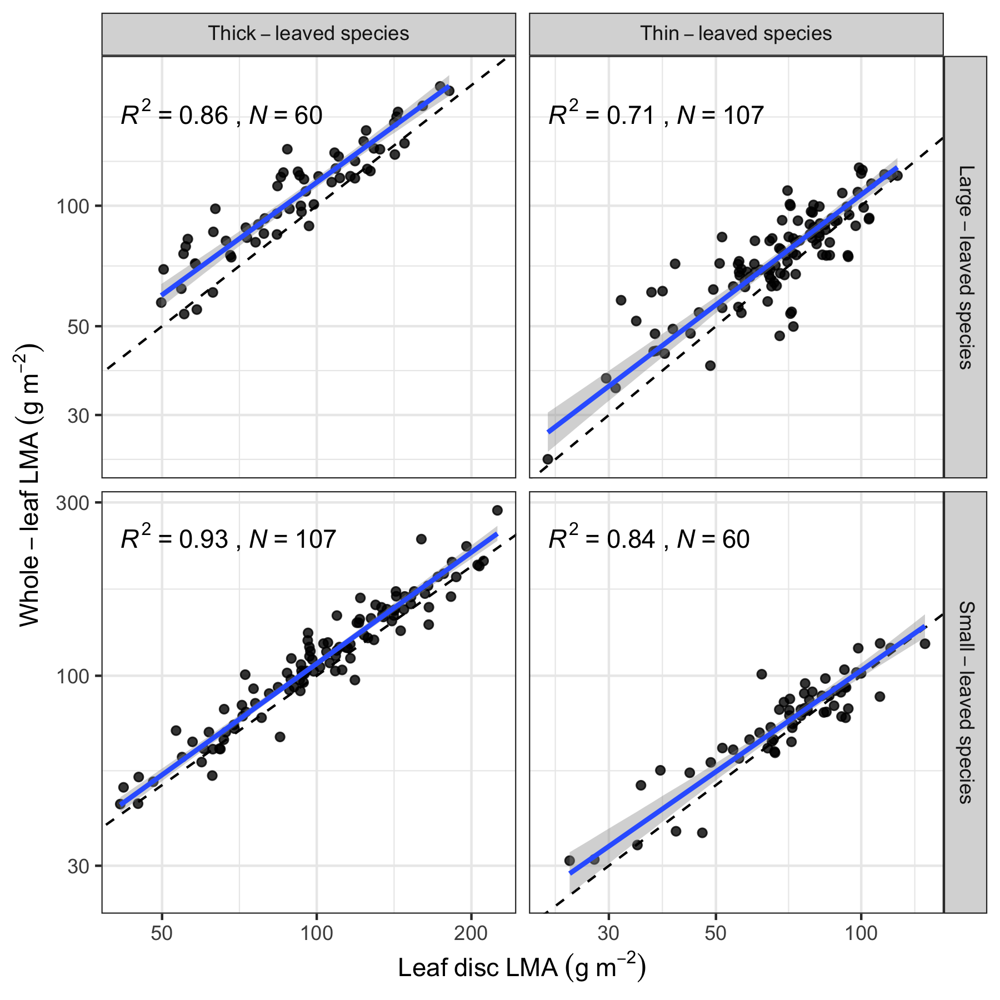
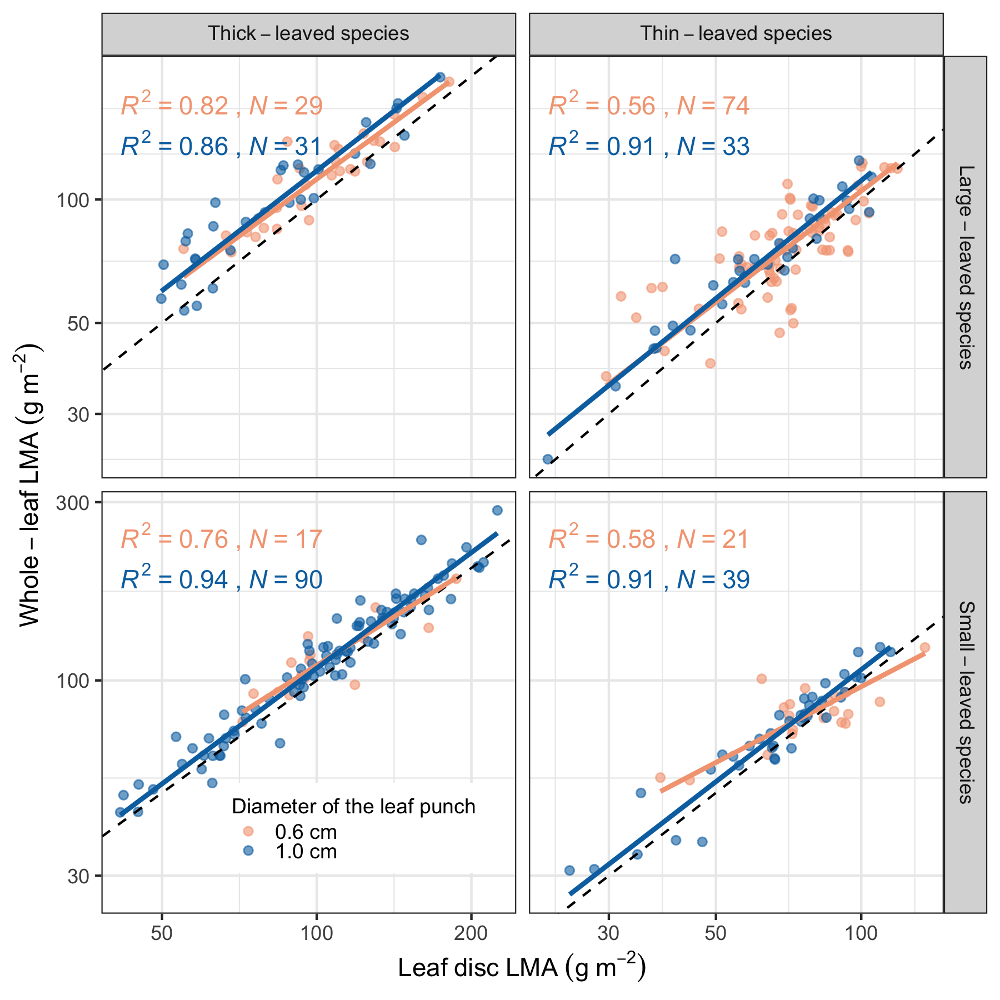
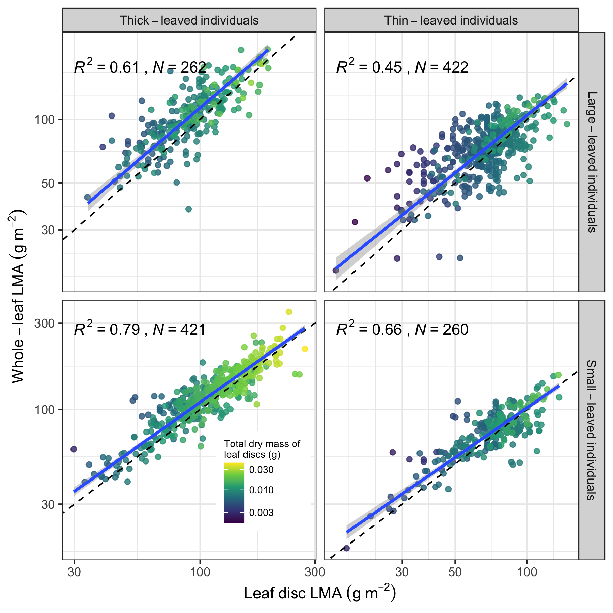
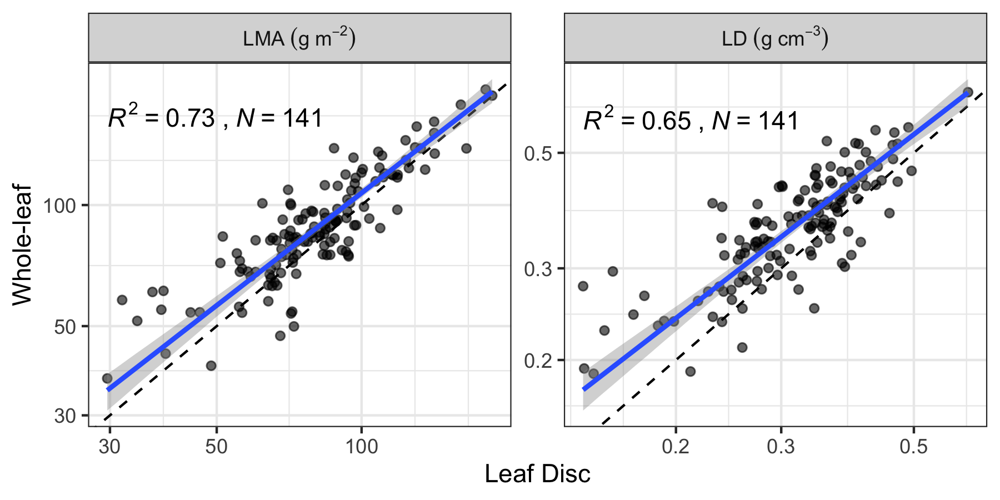
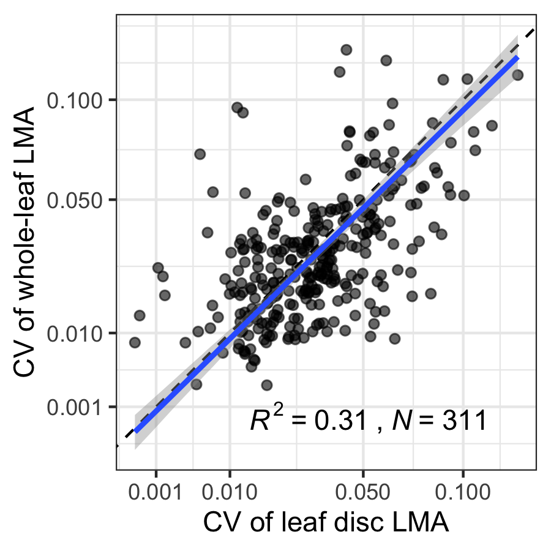
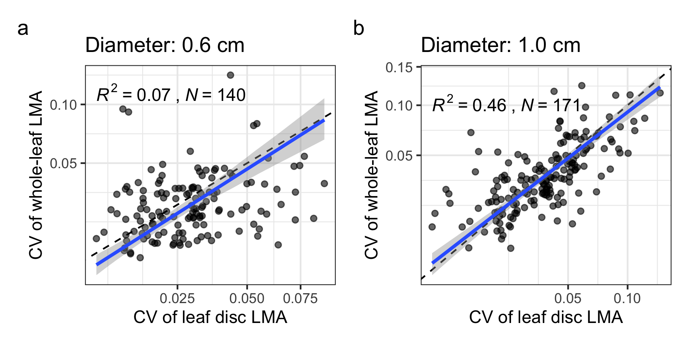

```{r, echo = F}
rm(list = ls())
```

```{r global_options, include=FALSE}
library(knitr)
basename <- "ms-trait-method"
opts_chunk$set(fig.path = paste0("components/figure/", basename, "-"),
               cache.path = paste0("components/cache/", basename, "/"))
knitr::opts_chunk$set(echo=TRUE,
                      cache=TRUE,
                      warning=FALSE,
                      message=FALSE)
```


# Library

```{r, cache=FALSE}
library(tidyverse)
library(tictoc)
library(patchwork)
library(smatr)
library(ggrepel)
library(ggpubr)
library(ggsma)
library(kableExtra)
library(lavaan)
source("../scripts/util.R")
```

```{r, cache=FALSE}
theme_set(theme_bw())
theme_update(text = element_text(family = "Arial"))
```

# Datasets

- with_pet: whole leaf with everything
- without_pet: whole leaf excluding midlib and petile
- disc: leaf disc

```{r}
d <- read_csv("../data/full_data.csv")
d_cv <- read_csv("../data/full_data_cv.csv")

d |>
  filter(LDleaf < 0.1)

d <- d |>
  filter(!is.na(LMAdisc)) |>
  filter(!is.na(LMAleaf)) |>
  filter(!is.na(LTleaf)) |>
  rename(LT = LTleaf) |>
  rename(LA = LAleaf) |>
  filter(Location %in% c("Ailao_understory", "Mengla_Bubeng", "Yuanjiang_Savanna", "Yakushima")) |>
  #filter(Location != "Yakushima") |>
  #mutate(LMAleaf = LMAlamina) |>
  mutate(LMAratio = LMAleaf / LMAdisc) |>
  mutate(LDratio = LDleaf / LDdisc)

table(d$Location, d$Contributor)
table(d$Location, d$Biomes)

LA1 <- quantile(d$LA, 0.25, na.rm = TRUE)
LA2 <- quantile(d$LA, 0.5, na.rm = TRUE)
LA3 <- quantile(d$LA, 0.75, na.rm = TRUE)
LT1 <- quantile(d$LT, 0.25, na.rm = TRUE)
LT2 <- quantile(d$LT, 0.5, na.rm = TRUE)
LT3 <- quantile(d$LT, 0.75, na.rm = TRUE)

LA_mid <- median(d$LA)
LT_mid <- median(d$LT, na.rm = TRUE)

d <- d |>
  mutate(LT_gr = case_when(
    LT < LT1 ~ "Very~thin",
    LT < LT2 ~ "Thin",
    LT < LT3 ~ "Thick",
    TRUE ~ "Very~thick")) |>
  mutate(LT_gr = factor(LT_gr, levels = c("Very~thin", "Thin", "Thick",
                                          "Very~thick"))) |>
  mutate(LA_gr = case_when(
    LA < LA1 ~ "Very~small",
    LA < LA2 ~ "Small",
    LA < LA3 ~ "Large",
    TRUE ~ "Very~large")) |>
  mutate(LA_gr = factor(LA_gr, levels = c("Very~small", "Small", "Large",
                                          "Very~large"))) |>
  mutate(LALT_gr = case_when(
   LA < LA_mid & LT < LT_mid ~ "Thin~Small",
   LA < LA_mid & LT >= LT_mid ~ "Thick~Small",
   LA >= LA_mid & LT < LT_mid ~ "Thin~Large",
   LA >= LA_mid & LT >= LT_mid ~ "Thick~Large",
   TRUE ~ "aa"
                          )) |>
  mutate(LA_gr2 = ifelse(LA < LA_mid, "Small-leaved~species",
                         "Large-leaved~species")) |>
  mutate(LT_gr2 = ifelse(LT < LT_mid, "Thin-leaved~species",
                         "Thick-leaved~species"))

d_cv <- d_cv |>
  dplyr::select(Species, Location,
                LMAleaf_cv = LMAleaf, LMAdisc_cv = LMAdisc,
                LDleaf_cv = LDleaf, LDdisc_cv = LDdisc) |>
  #full_join(d) |>
  filter(!is.na(LMAleaf_cv)) |>
  filter(!is.na(LMAdisc_cv))


d_cv2 <- d_cv |>
  full_join(d) |>
  filter(!is.na(LMAleaf_cv)) |>
  filter(!is.na(LMAdisc_cv))

d %>%
  head %>%
  kable() %>%
  kable_styling()
```

```{r}

d |>
  ggplot(aes(LA, fill = Location)) +
  geom_histogram() +
  geom_vline(xintercept = LA_mid)

```

```{r, p_all}

tic()
p_all <- d |>
ggplot(aes(LMAdisc, LMAleaf)) +
  facet_grid(LALT_gr ~ Location) +
  geom_abline(intercept = 0, slope = 1, lty = 2)  +
  geom_point() +
  geom_sma(se = TRUE) +
  scale_x_log10() +
  scale_y_log10() +
  stat_cor(
    aes(label = paste(..rr.label.., ..n.label.., sep = "~`,`~"), family = "Arial")
  )
toc()

ggsave("../figs/p_all.png", p_all, width = 8, height = 8)

```


```{r}

d |>
ggplot(aes(LMAdisc, LMAleaf, col = EveDec)) +
  facet_grid(LALT_gr ~ Location) +
  geom_abline(intercept = 0, slope = 1)  +
  geom_point() +
  geom_sma(se = FALSE) +
  scale_x_log10() +
  scale_y_log10() +
  stat_cor(
    aes(label = paste(..rr.label.., ..n.label.., sep = "~`,`~"), family = "Arial")
  )

d |>
ggplot(aes(LMAdisc, LMAleaf, col = EveDec)) +
  facet_wrap( ~ EveDec) +
  geom_abline(intercept = 0, slope = 1)  +
  geom_point() +
  geom_sma(se = FALSE) +
  scale_x_log10() +
  scale_y_log10() +
  stat_cor(
    aes(label = paste(..rr.label.., ..n.label.., sep = "~`,`~"), family = "Arial")
  )

d |>
  ggplot(aes(LMAleaf, LMAleaf / LMAdisc, col = Location)) +
  geom_point() +
  scale_x_log10()

d |>
  filter(Location == "Mengla_Bubeng") |>
  filter(LALT_gr == "Thin~Small") |>
  DT::datatable()

```

# errors

```{r}

d_cv2 |>
  ggplot(aes(x = LMAdisc, y = LMAdisc_cv, col = Location)) +
    geom_point() +
  scale_x_log10()

```


```{r, eval=FALSE}

set.seed(123)

n <- 100
sig_m <- 0.2
sig_a <- 0.2
sig_d <- 0.2
mu <- rlnorm(n, log(80), 0.6)
#logLMAleaf <- rnorm(n, log(mu), sig_d)
logLMAleaf <- rnorm(n, log(mu), sqrt(sig_m^2 + sig_a^2))
logLMAdisc <- rnorm(n, log(mu), sig_d)
cor(logLMAleaf, logLMAdisc)^2

plot(logLMAdisc, logLMAleaf)


M <- rlnorm(n, log(10), 0.8)
A <- rlnorm(n, 3 * log(M), 0.3)
plot(M, A, log = "xy")
LMA <- M / A
sd(log(LMA))
sig <- sqrt(sig_m^2 + sig_a^2)


mean_ <- NULL
sd_ <- NULL
for (i in 1:1000) {
  bb <- rnorm(n) - rnorm(n)
  mean_[i] <- mean(bb)
  sd_[i] <- sd(bb)
}

hist(mean_)
hist(sd_)
hist((sd_)^2)


cv <- \(x) sqrt(exp(sd(log(x[!is.na(x)]))^2) - 1)

cv(d$LMAleaf)
cv(d$LMAdisc)

d |>
  filter(Location == "Yakushima") |>
  pull(LMAleaf) |>
  sd()
d |>
  filter(Location == "Yakushima") |>
  pull(LMAdisc) |>
  sd()

d |>
  filter(Location != "Yakushima") |>
  pull(LMAleaf) |>
  sd()
d |>
  filter(Location != "Yakushima") |>
  pull(LMAdisc) |>
  sd()


d |>
  pull(LMAleaf) |>
  sd()
d |>
  pull(LMAdisc) |>
  sd()


cv(tmp$LMAleaf)
cv(tmp$LMAdisc)

cv(tmp2$LMAleaf)
cv(tmp2$LMAdisc)


```


```{r}

tmp <- read_csv("../data-raw/LMA_Raw.csv") |>
 mutate(LMAratio = LMAleaf / LMAdisc) |>
 mutate(LTdisc = (Thickness1_disc + Thickness2_disc + Thickness3_disc) / 3) |>
 mutate(LTlefa = (Thickness1_leaf + Thickness2_leaf + Thickness3_leaf) / 3) |>
 mutate(LDratio = LDleaf / LDdisc) |>
 mutate(LTratio = LTleaf / LTdisc)


log(tmp$LDratio) |> mean(na.rm = TRUE)
log(tmp$LMAratio) |> mean(na.rm = TRUE)
log(tmp$LTratio) |> mean(na.rm = TRUE)

log(tmp$LDratio) |> var(na.rm = TRUE)
log(tmp$LMAratio) |> var(na.rm = TRUE)
log(tmp$LTratio) |> var(na.rm = TRUE)

ggplot(tmp, aes(LTratio, LMAratio)) +
  geom_point() +
  scale_x_log10() +
  scale_y_log10()

cor.test(log(tmp$LTratio), log(tmp$LMAratio))


ggplot(tmp, aes(LTleaf, Thickness1_disc))  +
  geom_point() +
  scale_x_log10() +
  scale_y_log10()

hist(tmp$LMAleaf/tmp$LMAdisc)

log(tmp$LMAratio) |> sd(na.rm = TRUE)
log(tmp$LTleaf / tmp$Thickness1_disc) |> sd(na.rm = TRUE)
log(tmp$LDleaf / tmp$LDdisc) |> sd(na.rm = TRUE)


sig_fun <- \(sig1, sig2) {
  sig <- 1 / (1/sig1^2 + 1/sig2^2)
  sqrt(sig)
}

sqrt(0.253^2 + 0.152^2)

sig_fun(0.253, 0.152)

sig_fun(0.4, 0.6)


cor.test(log(tmp$LTleaf), log(tmp$Thickness1_disc))


tmp |>
  ggplot(aes(Dry_mass_disc, LMAleaf / LMAdisc)) +
  geom_point() +
  scale_x_log10()

tmp |>
  ggplot(aes(LMAdisc, LMAleaf / LMAdisc)) +
  geom_point() +
  scale_x_log10()

tmp |>
  ggplot(aes(Dry_mass_leaf, LMAleaf / LMAdisc)) +
  geom_point() +
  scale_x_log10()

tmp |>
  ggplot(aes(Leaf_area_leaf, LMAleaf / LMAdisc)) +
  geom_point() +
  scale_x_log10()


```


```{r}

tmp2 <- read_csv("../data-raw/leaf_traits_for_Katabuchi.csv")

tmp2 <- tmp2 |>
  rename(LMAleaf = "Whole leaf LMA") |>
  rename(LMAdisc = "LD LMA") |>
  mutate(Dry_mass_disc = LMAdisc * 1.57 * 10^-4)


tmp2 |>
  ggplot(aes(Dry_mass_disc * 2, LMAleaf / LMAdisc)) +
  geom_point() +
  scale_x_log10()

tmp2 |>
  ggplot(aes(`Scanned leaf DW`, LMAleaf / LMAdisc)) +
  geom_point() +
  scale_x_log10()

tmp2 |>
  ggplot(aes(`LA mean (leaf let)`, LMAleaf / LMAdisc)) +
  geom_point() +
  scale_x_log10()

```


```{r LMA-gr2}

p_LALT_grid <- d |>
  ggplot(aes(x = LMAdisc, y = LMAleaf)) +
  geom_point(alpha = 0.8) +
  scale_x_log10() +
  scale_y_log10() +
  geom_abline(slope = 1, intercept = 0, lty = 2) +
  geom_sma(se = TRUE) +
  facet_grid(LA_gr2~LT_gr2, scale = "free", labeller = label_parsed) +
  #facet_wrap(~LALT_gr, scale = "fixed", labeller = label_parsed) +
  xlab(expression(Leaf~disc~LMA~(g~m^{-2}))) +
  ylab(expression(Whole-leaf~LMA~(g~m^{-2}))) +
  stat_cor(
    aes(label = paste(..rr.label.., ..n.label.., sep = "~`,`~"), family = "Arial")
  )

ggsave("../figs/LMA_sp_gr.png", p_LALT_grid, width = 6, height = 6)

```




```{r LMA-gr-both}

my_col <- RColorBrewer::brewer.pal(4, "RdBu")

p_LALT_grid_both <- d |>
  mutate(punch_size = ifelse(Location == "Yakushima", "1.0 cm", "0.6 cm")) |>
  ggplot(aes(x = LMAdisc, y = LMAleaf, col = punch_size)) +
  geom_point(alpha = 0.6) +
  scale_x_log10() +
  scale_y_log10() +
  geom_abline(slope = 1, intercept = 0, lty = 2) +
  geom_sma(se = FALSE) +
  scale_color_manual(values = my_col[c(2, 4)],
                     name = "Diameter of the leaf punch") +
  facet_grid(LA_gr2~LT_gr2, scale = "free", labeller = label_parsed) +
  #facet_wrap(~LALT_gr, scale = "fixed", labeller = label_parsed) +
  xlab(expression(Leaf~disc~LMA~(g~m^{-2}))) +
  ylab(expression(Whole-leaf~LMA~(g~m^{-2}))) +
  stat_cor(
    aes(label = paste(..rr.label.., ..n.label.., sep = "~`,`~"), family = "Arial"),
    show.legend = FALSE
  ) +
 theme(legend.position = c(0.3, 0.1),
        legend.key.size = unit(0.5, "cm"),
        legend.spacing.y = unit(0.1, "cm"),
        legend.text.align = 0,
        legend.key.height = unit(0.2, "cm"),
        legend.text = element_text(size = 9),
        legend.title = element_text(size = 9)
 )
p_LALT_grid_both

ggsave("../figs/LMA_sp_gr_both.png", p_LALT_grid_both, width = 6, height = 6)

```



```{r LD-gr2}
p2_LALT_grid <- d |>
  filter(Location != "Yakushima") |>
  ggplot(aes(x = LDdisc, y = LDleaf)) +
  geom_point(alpha = 0.9) +
  scale_x_log10() +
  scale_y_log10() +
  geom_abline(slope = 1, intercept = 0, lty = 2) +
  geom_sma(se = TRUE) +
  facet_grid(LA_gr2~LT_gr2, scale = "free", labeller = label_parsed) +
  xlab(expression(Leaf~disc~LD~(g~cm^{-3}))) +
  ylab(expression(Whole-leaf~LD~(g~cm^{-3}))) +
  stat_cor(
    aes(label = paste(..rr.label.., ..n.label.., sep = "~`,`~"), family = "Arial")
  )

ggsave("../figs/LD_sp_gr.png", p2_LALT_grid, width = 6, height = 6)
```


```{r}
d |>
  ggplot(aes(x = LALT_gr, y = LMAleaf)) +
  geom_boxplot()
```


# SMA table

```{r}

sma_LMA <- sma(log10(LMAleaf) ~ log10(LMAdisc),
    data = d,
    elev.test = 0,
    slope.test = 1)

sma_LD <- sma(log10(LDleaf) ~ log10(LDdisc),
    data = d,
    elev.test = 0,
    slope.test = 1)

sma_LMA_LALT_gr <- sma(log10(LMAleaf) ~ log10(LMAdisc) * LALT_gr,
    data = d,
    elev.test = 0,
    slope.test = 1)

sma_LD_LALT_gr <- sma(log10(LDleaf) ~ log10(LDdisc) * LALT_gr,
    data = d,
    elev.test = 0,
    slope.test = 1)

my_fun <- function(fit) {
  tb1 <- fit$groupsummary |>
    mutate(Slope = paste0(round(Slope, 2), " [", round(Slope_lowCI, 2), ", ",
                          round(Slope_highCI, 2), "]"))|>
    mutate(Intecept = paste0(round(Int, 2), " [", round(Int_lowCI, 2), ", ",
                          round(Int_highCI, 2), "]"))|>
    mutate(sig_slope = case_when(
                             Slope_highCI < 1 ~ "sig",
                             Slope_lowCI > 1 ~ "sig",
                             TRUE ~ "ns"
                             )) |>
    mutate(sig_int = ifelse(Int_lowCI * Int_highCI > 0, "sig", "ns")) |>
    mutate(r2 = round(r2, 2)) |>
    dplyr::select(Slope, Intecept, r2, sig_slope, sig_int, group)
  tb2 <- tb1 |>
    mutate(Slope = ifelse(sig_slope == "sig", paste0("**", Slope, "**"), Slope)) |>
    mutate(Intecept = ifelse(sig_int == "sig", paste0("**", Intecept, "**"),
                             Intecept)) |>
    dplyr::select(Slope, Intecept, `*R^2^*` = r2)
  list(tb1, tb2, group = tb1$group)
}


tb0_LMA <- my_fun(sma_LMA)
tb0_LD <- my_fun(sma_LD)
tb2_LMA <- my_fun(sma_LMA_LALT_gr)
tb2_LD <- my_fun(sma_LD_LALT_gr)

#tb_dat <- rbind(cbind(tb0_LMA[[2]], tb0_LD[[2]]),
#  cbind(tb2_LMA[[2]], tb2_LD[[2]]))

tb_dat <- rbind(tb0_LMA[[2]], tb2_LMA[[2]])
tb_dat <- cbind(c("All", tb2_LMA$group), tb_dat) |>
  as.data.frame()

tb_dat %>%
  write_csv("../data/tab1.csv")

colnames(tb_dat)[1] <- "Data"
rownames(tb_dat) <- NULL

tb_dat |>
  kable() |>
 #pack_rows("all", 1, 1) |>
 #pack_rows("Site", 2, 6) |>
 #add_header_above(c(" ", "LMA" = 3, "LD" = 3)) |>
  kable_styling()

```

# ITV

- Yakushima: 1 cm diameter 2 discs
- Yunnan: 0.5 cm diamter, 3 discs

```{r}
tree <- read_csv("../data/tree_data.csv")

tree <- tree |>
  filter(!is.na(LMAdisc)) |>
  filter(!is.na(LMAleaf)) |>
  filter(!is.na(LTleaf)) |>
  rename(LT = LTleaf) |>
  rename(LA = LAleaf) |>
  mutate(Dry_mass_disc2 = case_when(
   Location == "Yakushima" ~ LMAdisc * 1.57 * 10^-4 / 2,
   TRUE ~ LMAdisc * 0.889 * 10^-4 / 3
                )) |>
  mutate(Dry_mass_disc = case_when(
   Location == "Yakushima" ~ LMAdisc * 1.57 * 10^-4,
   TRUE ~ LMAdisc * 0.889 * 10^-4
                ))

table(tree$Location, tree$Contributor)
table(tree$Location, tree$Biomes)

LA1_tree <- quantile(tree$LA, 0.25, na.rm = TRUE)
LA2_tree <- quantile(tree$LA, 0.5, na.rm = TRUE)
LA3_tree <- quantile(tree$LA, 0.75, na.rm = TRUE)
LT1_tree <- quantile(tree$LT, 0.25, na.rm = TRUE)
LT2_tree <- quantile(tree$LT, 0.5, na.rm = TRUE)
LT3_tree <- quantile(tree$LT, 0.75, na.rm = TRUE)

LA_mid_tree <- median(tree$LA, na.rm = TRUE)
LT_mid_tree <- median(tree$LT, na.rm = TRUE)

tree <- tree |>
  mutate(LT_gr = case_when(
    LT < LT1_tree ~ "Very~thin",
    LT < LT2_tree ~ "Thin",
    LT < LT3_tree ~ "Thick",
    TRUE ~ "Very~thick")) |>
  mutate(LT_gr = factor(LT_gr, levels = c("Very~thin", "Thin", "Thick",
                                          "Very~thick"))) |>
  mutate(LA_gr = case_when(
    LA < LA1_tree ~ "Very~small",
    LA < LA2_tree ~ "Small",
    LA < LA3_tree ~ "Large",
    TRUE ~ "Very~large")) |>
  mutate(LA_gr = factor(LA_gr, levels = c("Very~small", "Small", "Large",
                                          "Very~large"))) |>
  mutate(LALT_gr = case_when(
   LA < LA_mid_tree & LT < LT_mid_tree ~ "Thin~Small",
   LA < LA_mid_tree & LT >= LT_mid_tree ~ "Thick~Small",
   LA >= LA_mid_tree & LT < LT_mid_tree ~ "Thin~Large",
   LA >= LA_mid_tree & LT >= LT_mid_tree ~ "Thick~Large",
   TRUE ~ "aa"
                          )) |>
  mutate(LA_gr2 = ifelse(LA < LA_mid_tree, "Small-leaved~individuals",
                         "Large-leaved~individuals")) |>
  mutate(LT_gr2 = ifelse(LT < LT_mid_tree, "Thin-leaved~individuals",
                         "Thick-leaved~individuals"))

```


```{r}

tree |>
  group_by(LALT_gr) |>
  summarise(
          sd_LMAleaf = log10(LMAleaf) |> sd(),
          sd_LA = log10(LA) |> sd(),
          sd_LMAdisc = log10(LMAdisc) |> sd(),
          cv_LMAleaf = sd(log10(LMAleaf)) / mean(log10(LMAleaf)),
          cv_LMAdisc = sd(log10(LMAdisc)) / mean(log10(LMAdisc)),
          mean_LMAleaf = log10(LMAleaf) |> mean(),
          mean_LMAdisc = log10(LMAdisc) |> mean())

tree$LMAdisc |> log10() |> sd()
tree$LMAleaf |> log10() |> sd()


tree |>
  ggplot(aes(LMAdisc, LMAleaf, col = Dry_mass_disc)) +
    facet_grid(LALT_gr ~ Location) +
    geom_abline(intercept = 0, slope = 1)  +
    geom_point() +
    scale_color_viridis_c(trans = "log10") +
    geom_sma(se = FALSE) +
    scale_x_log10() +
    scale_y_log10() +
    stat_cor(
      aes(label = paste(..rr.label.., ..n.label.., sep = "~`,`~"), family = "Arial")
    )

```


```{r, LMAratio}

my_col <- RColorBrewer::brewer.pal(4, "RdBu")

LMAratio <- tree |>
  mutate(punch_size = ifelse(Location == "Yakushima", "1.0 cm", "0.6 cm")) |>
  ggplot(aes(Dry_mass_disc, LMAleaf / LMAdisc,
           # col = Dry_mass_disc
             col = punch_size
             )) +
  geom_point(alpha = 0.6) +
  geom_hline(yintercept = 1) +
  #scale_color_viridis_c(trans = "log10",
#                        name = "Total leaf disc \ndry mass (g)") +
  #scale_color_viridis_d() +
  scale_color_manual(values = my_col[c(2, 4)],
                     name = "Diameter of the leaf punch") +
#  scale_x_log10() +
  xlab("Total dry mass of leaf disc (g)") +
  ylab("Whole-leaf LMA / leaf disc LMA") +
  theme(
        legend.position = c(0.7, 0.75),
        legend.key.size = unit(0.5, "cm"),
        legend.spacing.y = unit(0.1, "cm"),
        legend.text.align = 0,
        legend.key.height = unit(0.3, "cm"),
        legend.text = element_text(size=7),
        legend.title = element_text(size=7))
#LMAratio

lmtest::bptest(lm(log(LMAleaf / LMAdisc) ~ log(Dry_mass_disc), tree))
lmtest::bptest(lm(log(LMAleaf / LMAdisc) ~ (Dry_mass_disc), tree))
lmtest::bptest(lm(log(LMAleaf / LMAdisc) ~ log(LT), tree))
lmtest::bptest(lm(log(LMAleaf / LMAdisc) ~ log(LA), tree))

LMAratio_LT <- tree |>
  mutate(punch_size = ifelse(Location == "Yakushima", "1.0 cm", "0.6 cm")) |>
  ggplot(aes(LT, LMAleaf / LMAdisc,
            col = Dry_mass_disc
             )) +
  geom_point(alpha = 0.6) +
  geom_hline(yintercept = 1) +
  scale_color_viridis_c(trans = "log10",
                        name = "Total leaf disc \ndry mass (g)") +
  #scale_color_viridis_d() +
  scale_x_log10() +
  xlab("Leaf thickness (mm)") +
  ylab("Whole-leaf LMA / leaf disc LMA") +
  theme(
        legend.position = c(0.7, 0.75),
        legend.key.size = unit(0.5, "cm"),
        legend.spacing.y = unit(0.1, "cm"),
        legend.text.align = 0,
        legend.key.height = unit(0.3, "cm"),
        legend.text = element_text(size=7),
        legend.title = element_text(size=7))
#LMAratio_LT

LMAratio_LA <- tree |>
  mutate(punch_size = ifelse(Location == "Yakushima", "1.0 cm", "0.6 cm")) |>
  ggplot(aes(LA, LMAleaf / LMAdisc,
            col = Dry_mass_disc
             )) +
  geom_point(alpha = 0.6) +
  geom_hline(yintercept = 1) +
  scale_color_viridis_c(trans = "log10",
                        name = "Total leaf disc \ndry mass (g)") +
  #scale_color_viridis_d() +
  scale_x_log10() +
  xlab(expression(Leaf~area~(m^2))) +
  ylab("Whole-leaf LMA / leaf disc LMA") +
  theme(
        legend.position = "none",
        #legend.position = c(0.2, 0.75),
        legend.key.size = unit(0.5, "cm"),
        legend.spacing.y = unit(0.1, "cm"),
        legend.text.align = 0,
        legend.key.height = unit(0.3, "cm"),
        legend.text = element_text(size=7),
        legend.title = element_text(size=7))
#LMAratio_LT

p_ratio <- LMAratio + LMAratio_LT + LMAratio_LA +
  plot_annotation(tag_levels = "a")

LDratio <- tree |>
  filter(Location != "Yakushima") |>
  ggplot(aes(Dry_mass_disc, LDleaf / LDdisc, col =
             Dry_mass_disc)) +
  geom_point(alpha = 0.8, show.legend = FALSE) +
  geom_hline(yintercept = 1) +
  scale_color_viridis_c(trans = "log10",
                        name = "Total leaf disc \ndry mass (g)") +
  # scale_color_viridis_d() +
  # scale_x_log10() +
  xlab("Total dry mass of leaf disc (g)") +
  ylab("Whole-leaf LD / leaf disc LD") +
  theme(
        legend.position = "none",
        legend.key.size = unit(0.5, "cm"),
        legend.spacing.y = unit(0.1, "cm"),
        legend.text.align = 0,
        legend.key.height = unit(0.4, "cm"),
        legend.text = element_text(size=7),
        legend.title = element_text(size=7))

#p_ratio <- LMAratio + LDratio  +
#  plot_annotation(tag_levels = "a")

ggsave("../figs/LMAratio.png", LMAratio, width = 3, height = 3)
ggsave("../figs/LMAratio2.png", p_ratio, width = 9, height = 3)

tmp <- tree |>
  filter(Location != "Yakushima") |>
  mutate(LDratio = LDleaf / LDdisc) |>
  mutate(LMAratio = LMAleaf / LMAdisc)

cor(tmp$LDratio, tmp$LMAratio)
cor(log(tmp$LDratio), log(tmp$LMAratio))

```


```{r, LMAratio4}

LMAratio4 <- tree |>
  filter(Location != "Yakushima") |>
  ggplot(aes(LMAleaf / LMAdisc, LDleaf / LDdisc, col =
             Dry_mass_disc)) +
  geom_abline(slope = 1, intercept = 0, lty = 2) +
  geom_point(alpha = 0.8) +
  scale_color_viridis_c(trans = "log10",
                        name = "Total leaf disc \ndry mass (g)") +
  #scale_color_viridis_d() +
#  scale_x_log10() +
  ylab("Whole-leaf LD / leaf disc LD") +
  xlab("Whole-leaf LMA / leaf disc LMA") +
  theme(
        legend.position = c(0.8, 0.75),
        legend.key.size = unit(0.5, "cm"),
        legend.spacing.y = unit(0.1, "cm"),
        legend.text.align = 0,
        legend.key.height = unit(0.3, "cm"),
        legend.text = element_text(size=7),
        legend.title = element_text(size=7))

ggsave("../figs/LMAratio4.png", LMAratio4, width = 3, height = 3)

```


```{r, LMAratio3}

LMAratio3 <- tree |>
  mutate(punch_size = ifelse(Location == "Yakushima", "1.0 cm", "0.6 cm")) |>
  ggplot(aes(LA, LMAleaf / LMAdisc,
           # col = Dry_mass_disc
             col = punch_size
             )) +
  geom_point(alpha = 0.6) +
  geom_hline(yintercept = 1) +
  #scale_color_viridis_c(trans = "log10",
#                        name = "Total leaf disc \ndry mass (g)") +
  #scale_color_viridis_d() +
  scale_x_log10() +
  scale_color_manual(values = my_col[c(2, 4)],
                     name = "Diameter of the leaf punch") +
  ylab("Whole-leaf LMA / leaf disc LMA") +
  xlab("Leaf area") +
  theme(
        legend.position = c(0.8, 0.75),
        legend.key.size = unit(0.5, "cm"),
        legend.spacing.y = unit(0.1, "cm"),
        legend.text.align = 0,
        legend.key.height = unit(0.3, "cm"),
        legend.text = element_text(size=7),
        legend.title = element_text(size=7))


tree |>
  mutate(punch_size = ifelse(Location == "Yakushima", "1.0 cm", "0.6 cm")) %>%
    lm(LMAleaf/LMAdisc ~ log(LT) + log(LA) + log(Dry_mass_disc) + punch_size, .) |>
  summary()


ggsave("../figs/LMAratio3.png", LMAratio3, width = 3, height = 3)

```


```{r}
tree |>
  ggplot(aes(x = LALT_gr, y = LMAleaf)) +
  geom_boxplot()
```

```{r LMA-gr2-ITV}

p_LALT_tree <- tree |>
  ggplot(aes(x = LMAdisc, y = LMAleaf, col = Dry_mass_disc)) +
  geom_point(alpha = 0.8) +
  scale_color_viridis_c(trans = "log10",
                        name = "Total dry mass of \nleaf discs (g)") +
  scale_x_log10() +
  scale_y_log10() +
  geom_abline(slope = 1, intercept = 0, lty = 2) +
  geom_sma(se = TRUE) +
  facet_grid(LA_gr2~LT_gr2, scale = "free", labeller = label_parsed) +
  xlab(expression(Leaf~disc~LMA~(g~m^{-2}))) +
  ylab(expression(Whole-leaf~LMA~(g~m^{-2}))) +
  stat_cor(
    aes(label = paste(..rr.label.., ..n.label.., sep = "~`,`~"), family = "Arial")
  ) +
  theme(legend.position = c(0.39, 0.15),
        legend.key.size = unit(0.5, "cm"),
        legend.spacing.y = unit(0.1, "cm"),
        legend.text.align = 0,
        legend.key.height = unit(0.3, "cm"),
        legend.text = element_text(size=7),
        legend.title = element_text(size=7))

ggsave("../figs/LMA_ind_gr.png", p_LALT_tree, width = 6, height = 6)

fit <- lm(log10(LMAleaf / LMAdisc) ~ log10(Dry_mass_disc), tree)
lmtest::bptest(fit)

```



```{r LD-gr2-ITV}
p2_LALT_tree <- tree |>
  filter(Location != "Yakushima") |>
  ggplot(aes(x = LDdisc, y = LDleaf, col = Dry_mass_disc)) +
  geom_point(alpha = 0.8) +
  scale_color_viridis_c(trans = "log10",
                        name = "Total dry mass of \nleaf discs (g)") +
  scale_x_log10() +
  scale_y_log10() +
  geom_abline(slope = 1, intercept = 0, lty = 2) +
  geom_sma(se = TRUE) +
  facet_grid(LA_gr2~LT_gr2, scale = "free", labeller = label_parsed) +
  xlab(expression(Leaf~disc~LD~(g~cm^{-3}))) +
  ylab(expression(Whole-leaf~LD~(g~cm^{-3}))) +
  stat_cor(
    aes(label = paste(..rr.label.., ..n.label.., sep = "~`,`~"), family = "Arial")
  ) +
  theme(legend.position = c(0.9, 0.15),
        legend.key.size = unit(0.5, "cm"),
        legend.spacing.y = unit(0.1, "cm"),
        legend.text.align = 0,
        legend.key.height = unit(0.4, "cm"),
        legend.text = element_text(size=7),
        legend.title = element_text(size=7))

ggsave("../figs/LD_ind_gr.png", p2_LALT_tree, width = 6, height = 6)
```


```{r}

tree |>
  group_by(Location) |>
  summarise(min = min(Dry_mass_disc))

tree |>
  ggplot(aes(Dry_mass_disc, LMAleaf / LMAdisc, col = Location)) +
  geom_point() +
  geom_vline(xintercept = 0.005) +
  scale_x_log10()

tree |>
  ggplot(aes(LMAdisc, LMAleaf / LMAdisc, col = Location)) +
  geom_point() +
#  geom_vline(xintercept = 0.005) +
  scale_x_log10()

tree |>
  filter(Dry_mass_disc < 0.007) |>
  ggplot(aes(LMAdisc, LMAleaf)) +
  #ggplot(aes(LMAdisc, LMAleaf, col = Location)) +
  geom_point() +
  scale_x_log10() +
  geom_abline(slope = 1, intercept = 0, lty = 2) +
  geom_sma(se = FALSE) +
#  facet_wrap(~ Location) |>
  stat_cor(
    aes(label = paste(..rr.label..,  ..n.label.., sep = "~`,`~"), family = "Arial")
  )


table(tree$EveDec, tree$LALT_gr)

r2 <- NULL
r22 <- NULL
n1 <- NULL
n2 <- NULL
for (i in 5:200) {
  tree_sub <- tree |>
    filter(Dry_mass_disc < i / 4000)
  tree_sub2 <- tree |>
    filter(Dry_mass_disc > i / 4000)
  if (nrow(tree_sub) >= 10) {
    r2[i] <- cor(log(tree_sub$LMAdisc), log(tree_sub$LMAleaf)) ^2
    r22[i] <- cor(log(tree_sub2$LMAdisc), log(tree_sub2$LMAleaf)) ^2
    n1[i] <- nrow(tree_sub)
    n2[i] <- nrow(tree_sub2)
  }
}
r2_dat <- tibble(r2, r22, n1, n2, dry_mass = (1:200) / 2000)

r2_dat |>
  filter(r2 > 0.6)

r2_dat <- tibble(`Data with dry mass smaller than the x-axis` = r2,
                 `Data with dry mass greater than the x-axis` = r22, n1, n2, dry_mass = (1:200) / 2000)

fig_dry <- r2_dat |>
  pivot_longer(1:2) |>
  filter(dry_mass < 0.05) |>
  filter(!is.na(value)) |>
  ggplot(aes(x = dry_mass, y = value, col = value))  +
  geom_point(alpha = 0.8) +
  geom_line() +
  scale_color_viridis_c(name = expression(italic(R^2))) +
  facet_wrap(~name)  +
  scale_x_log10(breaks = c(0.005, 0.01, 0.02, 0.03, 0.05)) +
#  coord_cartesian(xlim=c(0.002, 0.05)) +
  xlab("Dry mass of leaf disc(s) (g)") +
#  ylab(expression(italic(R^2)~between~whole-leaf~and~leaf~disc~LMA)) +
  ylab(expression(atop(italic(R^2)~between~whole-leaf~and,
                 leaf~disc~LMA))) +
  theme(legend.position = c(0.9, 0.25),
        legend.key.size = unit(0.5, "cm"),
        legend.spacing.y = unit(0.1, "cm"),
        legend.text.align = 0,
        legend.key.height = unit(0.4, "cm"),
        legend.text = element_text(size=6),
        legend.title = element_text(size=6))
ggsave("../figs/fig_dry_mass.png", fig_dry, width = 6, height = 3)


tree |>
  arrange(-Dry_mass_disc) |>
  ggplot(aes(LMAdisc, LMAleaf, col = Dry_mass_disc)) +
  geom_point(alpha = 0.8) +
  scale_color_viridis_c(trans = "log10") +
  scale_x_log10() +
  scale_y_log10()


tree |>
  ggplot(aes(Dry_mass_disc, fill = Location, col = Location)) +
  geom_histogram(position = "identity", alpha = 0.6) +
  scale_x_log10() +
  geom_vline(xintercept = 0.005) +
  geom_vline(xintercept = 0.0001)

tree |>
  ggplot(aes(Dry_mass_disc, fill = Location, col = Location)) +
  geom_histogram(position = "identity", alpha = 0.6) +
  facet_wrap( ~LALT_gr) +
  scale_x_log10() +
  geom_vline(xintercept = 0.005)

```


# LMA and LD

## Species mean

```{r}

d_leaf <- d |>
  dplyr::select(c(Species:Contributor, LMA = LMAleaf, LDMC = LDMCleaf, LD = LDleaf)) |>
  pivot_longer(LMA:LD, names_to = "trait", values_to = "Whole-leaf") |>
  filter(Location != "Yakushima" | trait != "LD") |>
  filter(Location != "Yakushima" | trait != "LMA")

d_disc <- d |>
  dplyr::select(Species, Location, LMA = LMAdisc, LDMC = LDMCdisc, LD = LDdisc) |>
  pivot_longer(LMA:LD, names_to = "trait", values_to = "Leaf Disc") |>
  filter(Location != "Yakushima" | trait != "LD") |>
  filter(Location != "Yakushima" | trait != "LMA")

d2 <- full_join(d_leaf, d_disc) |>
  mutate(trait = factor(trait, c("LMA", "LDMC", "LD"))) |>
  mutate(trait_lab = factor(trait,
                            labels = c("LMA~(g~m^{-2})",
                                       "LDMC~(g~g^{-1})",
                                       "LD~(g~cm^{-3})"
                            )))


d2 |>
  filter(trait == "LMA") |>
  filter(!is.na(`Whole-leaf`)) |>
  filter(!is.na(`Leaf Disc`)) |>
  dim()

d2 |>
  filter(trait == "LD") |>
  filter(!is.na(`Whole-leaf`)) |>
  filter(!is.na(`Leaf Disc`)) |>
  dim()

p_all <- d2 |>
  filter(trait != "LDMC") |>
  ggplot(aes(x = `Leaf Disc`, y = `Whole-leaf`)) +
  geom_abline(intercept = 0, slope = 1, lty = 2) +
  geom_point(alpha = 0.6) +
  scale_x_log10() +
  scale_y_log10() +
#  geom_smooth(method = "lm", se = FALSE) +
  geom_sma(se = TRUE) +
  facet_wrap(~trait_lab, scale = "free", labeller = label_parsed) +
  stat_cor(
    #aes(label = paste(..rr.label.., ..p.label.., sep = "~`,`~"))
    aes(label = paste(..rr.label..,  ..n.label.., sep = "~`,`~"), family = "Arial")
 #   label.x = 2
  )


ggsave("../figs/fig1.png", p_all, width = 6, height = 3)

```




## CV

```{r}

p_cv1 <- d_cv |>
  ggplot(aes(x = LMAdisc_cv, y = LMAleaf_cv)) +
  geom_abline(intercept = 0, slope = 1, lty = 2) +
  geom_point(alpha = 0.6) +
  scale_x_continuous(trans = "sqrt", breaks = c(0.001, 0.01, 0.05, 0.1)) +
  scale_y_continuous(trans = "sqrt", breaks = c(0.001, 0.01, 0.05, 0.1)) +
  geom_sma(se = TRUE) +
  ylab("CV of whole-leaf LMA") +
  xlab("CV of leaf disc LMA") +
  coord_fixed() +
  stat_cor(
           label.x.npc = 0.3,
           label.y.npc = 0,
           vjust = 1.5,
           aes(label = paste(..rr.label..,  ..n.label.., sep = "~`,`~"), family = "Arial")
               )
#p_cv1


cor(sqrt(d_cv$LMAleaf_cv), sqrt(d_cv$LMAdisc_cv))^2

p_cv2 <- d_cv |>
  filter(Location != "Yakushima") |>
  ggplot(aes(x = LMAdisc_cv, y = LMAleaf_cv)) +
  geom_abline(intercept = 0, slope = 1, lty = 2) +
  geom_point(alpha = 0.6) +
  scale_x_continuous(trans = "sqrt") +
  scale_y_continuous(trans = "sqrt") +
  geom_sma(se = TRUE) +
  ggtitle("Diameter: 0.6 cm") +
  ylab("CV of whole-leaf LMA") +
  xlab("CV of leaf disc LMA") +
  #coord_fixed(xlim = c(0.01, 5.4), ylim = c(0.01, 5.4)) +
  #coord_fixed() +
  stat_cor(
    aes(label = paste(..rr.label..,  ..n.label.., sep = "~`,`~"), family = "Arial")
  )

p_cv3 <- d_cv |>
  filter(!is.na(LDdisc_cv)) |>
  filter(!is.na(LDleaf_cv)) |>
  filter(Location != "Yakushima") |>
  ggplot(aes(x = LDdisc_cv, y = LDleaf_cv)) +
  geom_abline(intercept = 0, slope = 1, lty = 2) +
  geom_point(alpha = 0.6) +
  scale_x_log10() +
  scale_y_log10() +
  geom_sma(se = TRUE) +
  ggtitle("Diameter: 0.6 cm") +
  ylab("CV of whole-leaf LD") +
  xlab("CV of leaf disc LD") +
  #coord_fixed(xlim = c(0.01, 5.4), ylim = c(0.01, 5.4)) +
  #coord_fixed() +
  stat_cor(
    aes(label = paste(..rr.label..,  ..n.label.., sep = "~`,`~"), family = "Arial")
  )

hoge <- d_cv |>
  filter(Location != "Yakushima")
cor(sqrt(hoge$LMAleaf_cv), sqrt(hoge$LMAdisc_cv))^2

hoge <- d_cv |>
  filter(Location == "Yakushima")

cor(sqrt(hoge$LMAleaf_cv), sqrt(hoge$LMAdisc_cv))^2

cor(sqrt(d_cv$LMAleaf_cv), sqrt(d_cv$LMAdisc_cv))^2

#cor.test(log(hoge$LDleaf_cv), log(hoge$LDdisc_cv))

p_cv4 <- d_cv |>
  filter(Location == "Yakushima") |>
  ggplot(aes(x = LMAdisc_cv, y = LMAleaf_cv)) +
  geom_abline(intercept = 0, slope = 1, lty = 2) +
  geom_point(alpha = 0.6) +
  scale_x_continuous(trans = "sqrt") +
  scale_y_continuous(trans = "sqrt") +
  geom_sma(se = TRUE) +
  ggtitle("Diameter: 1.0 cm") +
  ylab("CV of whole-leaf LMA") +
  xlab("CV of leaf disc LMA") +
  #coord_fixed(xlim = c(0.01, 5.4), ylim = c(0.01, 5.4)) +
  #coord_fixed() +
  stat_cor(
    aes(label = paste(..rr.label..,  ..n.label.., sep = "~`,`~"), family = "Arial")
  )

p_cv <- (p_cv2 + p_cv4) +
  plot_annotation(tag_levels = "a")

ggsave("../figs/fig_cv2.png", p_cv, width = 6, height = 3)

ggsave("../figs/fig_cv.png", p_cv1, width = 3, height = 3)

ggsave("../figs/fig_cv_yaku.png", p_cv4, width = 3, height = 3)

```






We need to check sample size

```{r}
tmp <- table(d$Biomes, d$LA_gr) |> as.data.frame()
ggplot(tmp, aes(x = Var1, y = Freq, fill = Var2)) +
  geom_col(position = "fill")

ggplot(tmp, aes(x = Var2, y = Freq, fill = Var1)) +
  geom_col(position = "fill")


tmp2 <- table(d$Biomes, d$LT_gr) |> as.data.frame()
ggplot(tmp2, aes(x = Var1, y = Freq, fill = Var2)) +
  geom_col(position = "fill")

ggplot(tmp2, aes(x = Var2, y = Freq, fill = Var1)) +
  geom_col(position = "fill")

tmp3 <- table(d$Biomes, d$LALT_gr) |> as.data.frame()
ggplot(tmp3, aes(x = Var1, y = Freq, fill = Var2)) +
  geom_col(position = "fill")

ggplot(tmp3, aes(x = Var2, y = Freq, fill = Var1)) +
  geom_col(position = "fill")

```

```{r}

d |>
  #filter(LALT_gr == "Thin~Small") |>
  filter(LALT_gr == "Thin~Small") |>
  ggplot(aes(x = LA, y = LMAratio, col = Location)) +
    geom_point() +
    geom_abline(intercept = 1, slope = 0) +
#    geom_sma(se = TRUE) +
    facet_wrap(~Location) +
    scale_x_log10()

d |>
  #filter(LALT_gr == "Thin~Small") |>
  ggplot(aes(LMAratio, fill = Location)) +
    geom_histogram(position = "identity", alpha = 0.6)

d |>
  #filter(LALT_gr == "Thin~Small") |>
  ggplot(aes(y = LMAratio, x = Location, fill = Location)) +
    geom_violin(alpha = 0.6)

d |>
  ggplot(aes(x = LA, y = LMAratio, col = Location)) +
    geom_point() +
    geom_abline(intercept = 1, slope = 0) +
    facet_wrap(~LALT_gr, scale = "free_x") +
    scale_x_log10()


d |>
  ggplot(aes(x = LT, y = LMAratio, col = Location)) +
    geom_point() +
    geom_abline(intercept = 1, slope = 0) +
    facet_wrap(~LALT_gr, scale = "free_x") +
    scale_x_log10()

d |>
  ggplot(aes(x = LMAdisc, y = LMAleaf, col = Location)) +
    geom_point() +
    geom_abline(intercept = 0, slope = 1, lty = 2) +
    facet_wrap(~LALT_gr, scale = "free") +
#    geom_sma(se = FALSE) +
    scale_x_log10() +
    scale_y_log10() +
   # stat_cor(
   #          aes(label = paste(..rr.label.., ..n.label.., sep = "~`,`~"))
   # )

d |>
  ggplot(aes(x = LMAdisc, y = LMAleaf, col = LALT_gr)) +
    geom_point() +
    geom_abline(intercept = 0, slope = 1, lty = 2) +
    facet_wrap(~Location, scale = "free") +
    scale_x_log10() +
    scale_y_log10()

```


```{r}
d |>
  filter(LALT_gr == "Thin~Small") |>
  #filter(LALT_gr == "Thick~Large") |>
  DT::datatable()

hoge <- tree |>
  arrange(-LMAleaf/LMAdisc) %>%
    head

```

# Path

```{r}

tree2 <- tree |>
  mutate(PCH = ifelse(Location == "Yakushima", "1.0 cm", "0.6 cm")) |>
  mutate(d = LMAleaf/LMAdisc) |>
  mutate(LMA = abs(d - 1) |> log()) |>
  mutate(LT = log(LT)) |>
  mutate(LA = log(LA)) |>
  mutate(DM = log(Dry_mass_disc)) |>
  mutate(LMAw = log(LMAleaf)) |>
  mutate(LMAd = log(LMAdisc))

model1 <- 'LMA ~ LT + LA + DM
           DM ~ LT + LA + PCH'
          #LT ~ LA
fit1 <- sem(model1, data = tree2)
fitMeasures(fit1)

#lm(LMA ~ scale(exp(DM)) * scale(LT), tree2) |>
#  summary()
#

#plot(exp(LMA) ~ LT, tree2)
#plot(exp(LMA) ~ DM, tree2)

lm(LMA ~ LT * DM, tree2) |>
  summary()
lm(LMA ~ LT, tree2) |>
  summary()
lm(LMA ~ DM, tree2) |>
  summary()
#modificationindices(fit1)


#parameterEstimates(fit1, standardized = TRUE) |>
#  as_tibble() |>
#  filter(op == "~")j

standardizedSolution(fit1) |>
  DT::datatable()

p <- semPlot::semPaths(fit1,
                  layout = "tree",
                  shapeLat = "ellipse",
                  whatLabels  = "stand",
                  residuals = FALSE,
                  nDigits = 3, shapeMan = "square", sizeMan = 8,
                  sizeLat = 8, sizeLat2 = 8, style = "lisrel",
                  residScale = 12, curve = 2.5, optimizeLatRes = T,
                  edge.color = "black",
                  rotation = 2, edge.label.cex = 1)

pvalue_cutoff <- 0.05
obj <- semPlot:::semPlotModel(fit1)

original_Pars <- obj@Pars

check_Pars <- obj@Pars %>%
  dplyr::filter(!(edge %in% c("int","<->") | lhs == rhs))
# this is the list of paramater to sift thru
keep_Pars <- obj@Pars %>%
  dplyr::filter(edge %in% c("int","<->") | lhs == rhs)
# this is the list of paramater to keep asis
test_against <- lavaan::standardizedSolution(fit1) %>%
  dplyr::filter(pvalue < pvalue_cutoff, rhs != lhs)

test_against_rev <- test_against %>%
  rename(rhs2 = lhs,
         lhs = rhs) %>%
    rename(rhs = rhs2)
# I'll have to reverse it myself, and test against both orders

checked_Pars <-
    check_Pars %>% semi_join(test_against, by = c("lhs", "rhs")) %>%
    bind_rows(
        check_Pars %>% semi_join(test_against_rev, by = c("lhs", "rhs"))
    )

obj@Pars <- keep_Pars %>% bind_rows(checked_Pars)

#let's verify by looking at the list of the edges we removed from the object
anti_join(original_Pars, obj@Pars)

tmp <- RColorBrewer::brewer.pal(4, "RdBu")[c(4, 1)]
p2 <- semPlot::semPaths(obj,
                  "par",
                  whatLabels  = "stand",
                  exoCov = FALSE,
                  residuals = FALSE,
                  style = "lisrel",
                  sizeMan = 10,
                  sizeInt = 15,
                  sizeLat = 5,
                  posCol = tmp,
                  edge.label.cex = 2,
                  fade = FALSE)

png("../figs/path.png", width = 4, height = 4, units = "in", res = 200)
plot(p2)
dev.off()

```

```{r, eval=FALSE, echo=TRUE}

tree <- read_csv("./data/tree_data.csv")

tree2 <- tree |>
  filter(!is.na(LMAdisc)) |>
  filter(!is.na(LMAleaf)) |>
  filter(!is.na(LTleaf)) |>
  rename(LT = LTleaf) |>
  rename(LA = LAleaf) |>
  mutate(Dry_mass_disc2 = case_when(
   Location == "Yakushima" ~ LMAdisc * 1.57 * 10^-4 / 2,
   TRUE ~ LMAdisc * 0.889 * 10^-4 / 3
                )) |>
  mutate(Dry_mass_disc = case_when(
   Location == "Yakushima" ~ LMAdisc * 1.57 * 10^-4,
   TRUE ~ LMAdisc * 0.889 * 10^-4
                )) |>
  mutate(PCH = ifelse(Location == "Yakushima", "1.0 cm", "0.6 cm"))

fit <- lm(log(Dry_mass_disc) ~ scale(log(LT)) + scale(log(LA)) + PCH, tree2)

s <- summary(fit)
tb <- s$coefficients |> round(3) |> signif(3)
colnames(tb) <- c("Estimate", "SE", "t-value", "*P* value")
tb[,4] <- ifelse(tb[,4] < 0.001, "< 0.001", tb[,4])
rownames(tb)[2] <- "log(Leaf thickness)"
rownames(tb)[3] <- "log(Leaf area)"
rownames(tb)[4] <- "Large leaf punch"

tb |>
  kable() |>
  kable_styling()
```


# Petiole

## Yakushima

```{r, eval=TRUE}
d3 <- read_csv("../data-raw/leaf_traits_for_Katabuchi.csv")

yaku <- d3 |>
  filter(Growthform != "H") |>
  mutate(Location = "Yakushima") |>
  mutate(Biomes = "ST2") |>
  mutate(Garden = "NO") |>
  mutate(MAT = NA) |>
  mutate(MAP = NA) |>
  mutate(Contributor = "Onoda Yusuke") |>
  rename(
                LA = `LA mean (leaf let)`,
                LT = `Lamina thickness`,
                LMAdisc = `LD LMA`,
                LMAleaf = `Whole leaf LMA`,
                LDMCleaf = `LDMC`,
                LDdisc = `TD`
  ) |>
  mutate(LDleaf = LMAleaf / LT * 10^-3) %>%
  mutate(LDMCdisc = NA) |>
  mutate(LTdisc = NA) |>
  mutate(Growthform = ifelse(Growthform == "W", "Trees", Growthform)) |>
  mutate(petiole_ratio = `petiole DW`/`Scanned leaf DW`)# |>
#  filter(!is.na(petiole_ratio))

d3 |>
  filter(Species == "Symplocos_myrtacea") |>
  DT::datatable()

yaku_sp <- yaku |>
  group_by(Species) |>
  summarize_at(
               .vars = vars(
             LMAdisc,
             LMAleaf,
             LDMCdisc,
             LDMCleaf,
             LDdisc,
             LDleaf,
             LT,
             LTdisc,
             LA,
             petiole_ratio
               ),
    .funs =  \(x)mean(x, na.rm = TRUE)) |>
  filter(petiole_ratio > 0) |>
  filter(!is.na(LMAdisc))

pet1 <- ggplot(yaku_sp, aes(x = petiole_ratio, y = LMAleaf/LMAdisc)) +
  geom_point() +
  scale_x_log10() +
  #xlab(expression(Petiole/leaf~dry~mass~ratio(g~g^-1))) +
  xlab("Petiole / leaf dry mass ratio") +
  ylab("Whole-leaf / leaf disc LMA ratio") +
  geom_smooth(method = "lm") +
  stat_cor(
    aes(label = paste(..rr.label.., ..n.label.., sep = "~`,`~"), family = "Arial")
  )

pet2 <- ggplot(yaku_sp, aes(x = petiole_ratio, y = LA)) +
  geom_point() +
  scale_x_log10() +
  scale_y_log10() +
  xlab("Petiole / leaf dry mass ratio") +
  ylab(expression(Leaf~area~(g~cm^2))) +
  geom_smooth(method = "lm") +
  stat_cor(
    aes(label = paste(..rr.label.., ..n.label.., sep = "~`,`~"), family = "Arial")
  )

pet3 <- pet2 + pet1 +
  plot_annotation(tag_levels = "a") &
  theme(plot.tag = element_text(face = "bold"))

ggsave("../figs/petiole.png", pet3, width = 8, height = 4)

x <- rnorm(100)
y <- rnorm(100)

cv_x <- sd(x) / mean(x)
cv_y <- sd(y) / mean(y)
cov(x, y)
cov(cv_x, cv_y)


hist(yaku_sp$petiole_ratio)
hist(yaku_sp$LMAleaf/yaku_sp$LMAdisc)

```


## CV test

```{r, eval=FALSE}

cv_ln <- \(sigma) sqrt(exp(sigma^2) - 1)
sigma <- 0.8
e <- seq(0.1, 2, length = 80)
plot(sigma*e, cv_ln(sigma*e), type = "l", col = "blue")
points(sigma*e, sigma*e, type = "l")
#points(sigma*e, sigma*e*e, type = "l", col = "red")


# rlnorm(10, 0, 0.001)

cv <- \(x) sd(x)/mean(x)
cv_e <- \(x, e) sqrt(var(x) + var(e))/mean(x)


cv2 <- \(mu1,sig1, sig2) {sqrt(sig1^2*sig2^2 + mu1*sig2^2 + sig1^2)}

mu <- 2
sig1 <- seq(0.1, 2, length = 80)
sig2 <- 0.9
plot(sig1, sig1, type = "l")
points(sig1, cv2(mu, sig1, sig2), type = "l", col = "blue")


tmp <- rnorm(100, mu, sig)
mean(tmp)
sd(tmp)
cv(tmp)

mu <- 10
sig <- 2
hoge <- NULL
e <- rlnorm(100, 0, 0.5)
hist(e)
for (i in 1:100){
 hoge[i] <- cv(rnorm(100, mu, sig)) / cv(rnorm(100, mu, sig) * e)
}

hist(hoge)
rnorm(100, -3, 0.4) |> exp() |> hist()

sqrt(3 + 2)
sqrt(3)

x <- rnorm(1000)
y <- rnorm(1000, 0, 10)
cov(x, x+y)
cov(x, y) + var(x)
var(x)

1 - pbinom(7, 20, 0.25)
1 - pnorm(1.29)

# sp
n <- 100
# tree
m <- 10
mu <- 10
sig <- 2
sig2 <- 0.5
sig3 <- 1

#set.seed(123)
mu_i <- rnorm(n, mu, sig)
mu2_i <- mu_i + rnorm(n, 0, sig2)

cv1 <- mapply(rnorm, m, mu_i, sig3) |>
  apply(2, cv)
cv2 <- mapply(rnorm, m, mu2_i, sig3) |>
  apply(2, cv)
plot(cv1, cv2)
cor.test(cv1, cv2)


```


# Computing Environment

```{r}
devtools::session_info()
```

