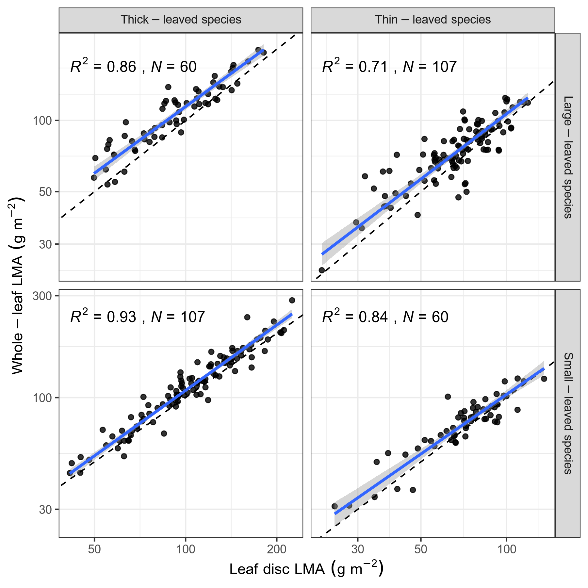
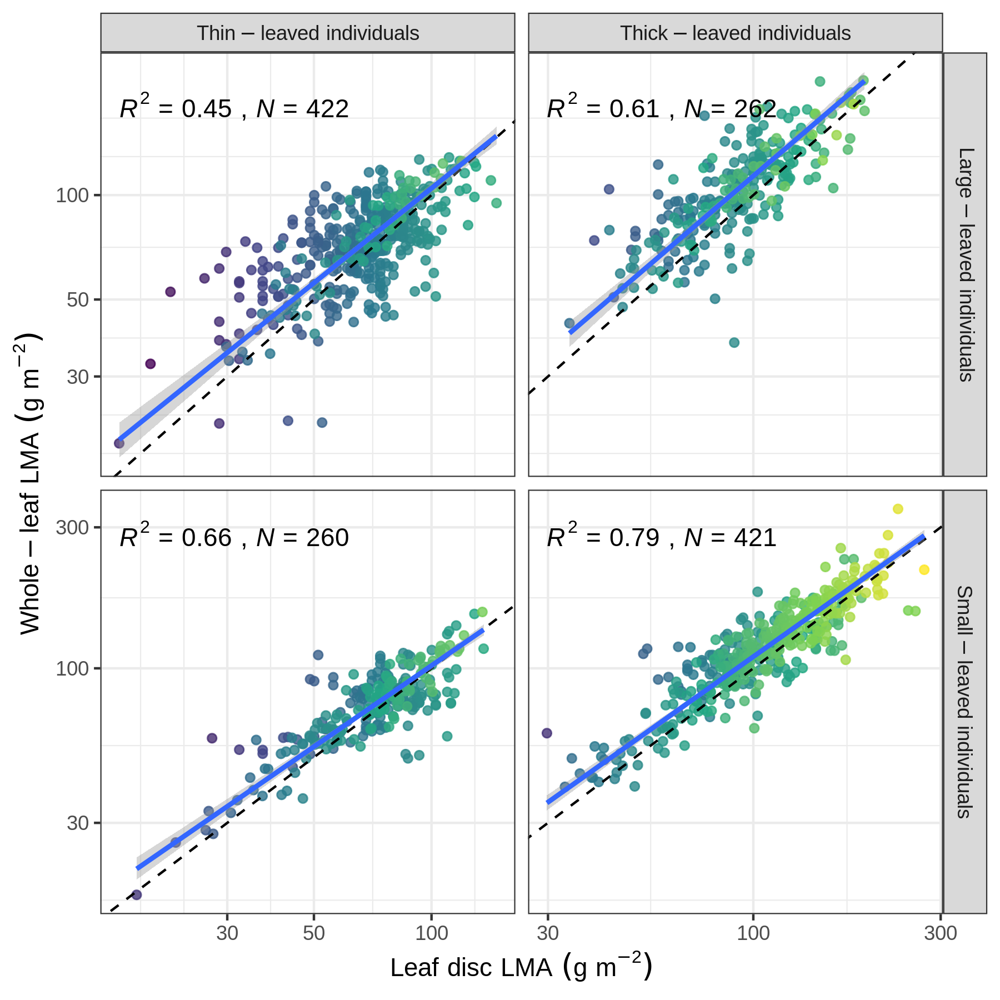

```{r caching, include=FALSE}
library(knitr)
library(tidyverse)
library(methods)
source("../scripts/rmd_func.R")
basename <- "LMA_method"
opts_chunk$set(fig.path = paste("figs/", sep = ""))
opts_chunk$set(
  tidy = FALSE, warning = FALSE, message = FALSE,
  comment = NA, verbose = TRUE, echo = FALSE
)
# PDF-based figures
opts_chunk$set(dev = "pdf")

# https://github.com/haozhu233/kableExtra/issues/477
options(kableExtra.auto_format = FALSE)
library(kableExtra)

val <- yaml::yaml.load_file("../values.yml")
```

Sources and consequences of mismatch between leaf disc and whole-leaf leaf mass per area (LMA)

$$ $$

Phisamai Maenpuen^1,2,3^,
Masatoshi Katabuchi^1\*^,
Yusuke Onoda^4^,
Cong Zhou^1,2^,
Jiao-Lin Zhang^1,3\*^,
Ya-Jun Chen^1,3,5^

$$ $$

^1^ CAS Key Laboratory of Tropical Forest Ecology, Xishuangbanna Tropical Botanical Garden, Chinese Academy of Sciences, Menglun, Yunnan 666303, China

^2^ University of Chinese Academy of Sciences, Beijing 100049, China

^3^ Center of Plant Ecology, Core Botanical Gardens, Chinese Academy of Sciences, Yunnan 666303, China

^4^ Graduate School of Agriculture, Kyoto University, Kyoto 606-8502, Japan

^5^ Savanna Ecosystem Research Station, Xishuangbanna Tropical Botanical Garden, Chinese Academy of Sciences, Yuanjiang, Yunnan 6663300, China

$$ $$

**Corresponding Authors**:

Masatoshi Katabuchi

E-mail: mattocci27@gmail.com

Jiao-Lin Zhang

Tel: +86 691 871 3046;
Fax: +86 691 871 5070;
E-mail: zjl@xtbg.org.cn

$$ $$

Manuscript received _______; revision accepted _______.

**Running title**: Leaf disc and whole-leaf LMA

\newpage

# ABSTRACT

**PREMISE:**
Leaf mass per area (LMA), which is the key trait in leaf economic spectrum and plant growth analysis, is measured from leaf discs or whole leaves.
These differences in the measurement methods may lead to large differences in the estimates of LMA values.

**METHODS:**
We determined LMA using leaf discs and whole-leaf (including petiole) for `r val$all_sp` woody species from a wide range of biomes (tropics, subtropics, savanna, and temperate) to examine what extent whole-leaf and leaf disc LMA match, whether the differences in the estimates are associated with leaf size and thickness, and whether intraspecifc variation for each species match.

**RESULTS:**
Disc-based estimates of species and individual mean LMA matched well whole-leaf estimates.
Thin and large leaves had weaker correlations between leaf disc and whole-leaf estimates.
Variability of LMA estimates within species (i.e., amount of intraspecific variation) only weakly matched between whole-leaf and disc-based estimates (*R^2^* = `r val$cv_r2`).
We also found that sample with small total dry mass of leaf discs tended to show greater differences between leaf disc and whole-leaf LMA.

**CONCLUSIONS:**
Mean values of leaf disc LMA are generally good proxies for mean values of whole-leaf LMA with appropriate calibration (9.4% differences in our samples), but their accuracy depends on leaf size, leaf thickness, and sizes of leaf punch.
Therefore, using an appropriate size of leaf punch is important for obtaining stable estimates of leaf disc LMA that matches well with whole-leaf LMA.
Quantifying trait variation using leaf disc should be considered with caution.

**KEY WORDS:**
intraspecific variation,
leaf density,
leaf economic spectrum,
leaf heterogeneity,
leaf punch,
leaf size,
leaf thickness,
petiole,
specific leaf area,
within-leaf variation

# INTRODUCTION

Leaf mass per area (LMA), determined by lamina thickness and leaf tissue density (LD), describes how much biomass is invested into given photosynthetic leaf area thus reflecting a cost for light interception, which is the key trait of the leaf economic spectrum (LES) [@Wright2004a; @Poorter2009; @Onoda2017].
Generally, resource-acquisitive species (fast-growing species) tend to have low LMA values, showing high photosynthesis, high nutrients, and often have fast leaf turnover [@Wright2004a].
In contrast, resource-conservative species (slow-growing species) often have higher LMA values with the opposite patterns [@Garnier1994; @Wright2004a; @Reich2014; @Diaz2016].
The LMA is also frequently used in plant growth analysis [@Evans1972; @Poorter2014; @Falster2018] because relative growth rates (RGR) can be decomposed into the product of net assimilation rate (NAR), leaf mass ratio (LMR) and LMA (i.e., RGR = NAR $\times$  LMR $\times$ LMA^-1^).
Another appealing feature of LMA is that it is relatively easy to measure large numbers of species [i.e., 'soft' trait, @Diaz2004].
Therefore, LMA has been of interests to ecologists and widely used since the first report more than a century ago [@Hanson1917].

LMA values can be determined by either
1) a whole leaf including or excluding petioles, and
2) a leaf disc excluding all major veins or petioles [@Perez-Harguindeguy2013; @Kattge2020].
Although some studies do not make clear what protocol was followed, these differences in the measurement methods may lead to large discrepancies in the estimates of LMA values because the major vein allocation (major vein, which includes first to second or third-order veins, volume per area) has been reported to be one of the main determinants for the variation in LMA [@John2017].
Since larger leaves tend to invest more of their mass into dense midribs and petiole for support [@Niinemets2006; @Niinemets2007], and thinner leaves have clearly visible and large-diameter veins with less uniform leaf structure (i.e., kite-type leaves; [@Grubb1986]), discrepancies in the estimates of whole-leaf LMA and leaf disc LMA might be greater for larger and thinner leaves.
If leaf disc LMA largely and consistently underestimates whole-leaf LMA, some calibrations may be required to combine or compare those different estimates [@Kraft2008; @Onoda2011].
If divergencies between the estimates based on the different methods are large and inconsistent (i.e., low *R^2^* values), this is difficult to calibrate and should inflate errors in the subsequent analyses.
To date, however, only a database from a single region, Panama Plant Traits Database [@Wright2010], is available in the TRY [@Kattge2020] that have both estimates of LMA from small leaf discs and whole leaves including petioles, limiting of our understanding of under what conditions estimates of LMA from leaf discs are reliable estimates of whole-leaf LMA.

Given that leaf disc samples have more sources of intraspecific trait variation (ITV) than whole-leaf samples, the effects of discrepancies between whole-leaf LMA and leaf disc LMA might be large when ITV is quantified as a coefficient of variance (CV).
Sources of ITV for whole-leaf samples is variation among individuals within the same species and variation among leaves within the same individuals [@Messier2010; @Messier2017].
An additional source of trait variation for leaf disc samples is variation among leaf discs within the same leaves.
Thus, extents of ITV for each species based on whole-leaf and leaf discs samples may not match.
Despite the importance of ITV in community ecology [@Kichenin2013; @Siefert2015], the effect of different measurement methods on the extent of ITV has been largely ignored.

In this study, we aimed to investigate what extent whole-leaf (including petiole) and leaf disc LMA match, whether the relationships between whole-leaf LMA and leaf disc LMA varied in leaf sizes and leaf thicknesses, and whether amounts of intraspecifc variations for each match between whole-leaf and leaf disc based estimates.
We collected a total of `r val$all_sp` woody species from four biomes (tropics, subtropics, savanna, and warm-temperate) to cover the wide range of geography.
We predicted that the overall relationship between whole-leaf LMA and disc LMA would be weaker than previous reported LMA data (*R^2^* = 0.92 for whole-leaves in @Kraft2008, *R^2^* = 0.92 for leaf laminas in @Onoda2011) because we collected data with various leaf sizes from a wide range of climates.
We also predicted that species with larger and/or thinner leaves would show weaker correlations.
Finally, we predicted that amounts of intraspecifc variations for each species do not match well between whole-leaf and leaf disc based estimates.

# MATERIALS AND METHODS

*Data sources*

We used newly compiled individual-level plant datasets form a wide ranges of biomes in China and Japan (Table S1) to examine the relationship between whole-leaf and leaf disc-based estimates of leaf traits.
First, the Yunnan dataset is from three forest plots in Yunnan province, Southwest China, which includes a tropical rain forest (TRF), a hot-dry savanna ecosystem (HDS), and a subtropical evergreen wet forest (STF), with a total of `r val$sp1` species and `r val$tree1` individuals.
Second, the Yakushima data is from a warm-temperate forest in Yakushima island, Japan, with a total of `r val$yaku_sp` species and `r val$tree3` individuals.
In total, we used `r val$all_sp` woody species and `r val$all_tree` individuals.
The methodologies for trait sampling and measurement are slightly different between the Yunnan and the Yakushima dataset, which we describe bellow.

*Measurements of leaf disc and whole-leaf LMA*

At the TRF site, we collected leaf samples from trees within reach of a canopy crane (88 m tall with a 60 m long boom).
In the HDS, and STF sites, we used a 12-m long pruner to collect samples for most of the target species.
In case of tall individuals that out of the reach of pruner, we used a rope climbing to reach the canopy, then sampled branches with the long pruner.
In Yakushima, we used 15-m poles for our leaf sampling.
At least six sun-exposed healthy leaves were sampled from each of 3 to 6 individuals for each species.
Trait values were averaged at the species- and individual-level for the analyses.
For compound-leaved species, we referred a leaflet (the minimum photosynthetic unit) as a single leaf in our study.

To determine what extent LMA values were affected by the different methods, LMA were determined (i) LMA based on a whole leaf including petioles and (ii) LMA based on leaf disc avoiding thick veins.
Three 0.6-cm diameter discs were taken from the base, middle and tip of each leaf using a hole punch in the Yunnan dataset.
Two 1.0-cm diameter discs were taken from each leaf were in the Yakushima dataset.
Fresh leaf area (LA; cm^-2^) of leaf materials (whole leaves including petioles and midribs) was measured using a scanner and ImageJ software by the R package *LeafArea* [@Katabuchi2015].
Fresh leaf thickness (LT; mm) was measured using a micrometer in three points at the base, middle and tip of the leaf using a micrometer (Mitutoyo 293-240, Mitutoyo Corporation, Kawasaki, Japan) with a precision at 0.001 mm.
Thickness of each leaf disc was also measured for the Yunnan dataset but not for the Yakushima dataset, which enables us to estimate whole-leaf and leaf disc leaf tissue density (LD; g cm^-3^) separately in the Yunnan dataset.
Leaf dry mass (whole leaves including petioles and midribs, and leaf discs) was recorded after drying 80°C for over 48 h to constant weight using an electronic scale (Mettler-Toledo MS204TS, Columbus, OH, U.S.A.) with a precision at 0.0001 g.
In the subset of Yakushima dataset, leaf lamina and petiole dry mass were also determined separately (`r val$pet_sp` out of `r val$yaku_sp` species) to quantify leaf support costs.
Dry mass for leaf discs were recorded 2-3 discs together for each leaf.
Based on those measurements of whole-leaf and leaf disc samples, LMA (g m^-2^) was calculated as the ratio of leaf dry mass to fresh leaf area, and LD was calculated as the ratio of LMA to LT.
We do not present results of LD in the main text, because differences between whole-leaf LD and leaf disc LD only depends on the ratio between whole-leaf LMA and leaf disc LMA and measurement errors of leaf thickness (Appendix S2).

*Effects of leaf area and thickness on the relationship between whole-leaf and leaf disc LMA*

To quantify the effect of leaf area and thickness on the relationship between whole-leaf and leaf disc LMA, we built a hierarchical Bayesian model.
The whole-leaf LMA was assumed to follow a normal distribution (N) with the mean of leaf disc LMA and covariates of  leaf area and leaf thickness on the log-scale;

\begin{align}
\mathrm{ln}(LMA_{Wi}) & \sim N(\mathrm{ln}(LMA_{Di}) + \tilde{\mu_i}, \sigma_i) (\#eq:LMA)\\
\tilde{\mu_i} & = \beta_0 + \beta_1 \mathrm{ln}(LA_{i}) + \beta_2 \mathrm{ln}(LT_{i}) (\#eq:mu)
\end{align}

where $LMA_{Wi}$, $LA_{i}$, $LT_{i}$ are the observed whole-leaf LMA, leaf area and leaf thickness for tree *i*, respectively,
$LMA_{Di}$ is the true unobserved value of leaf disc LMA for tree *i*, which can be modeled using the observed leaf disc LMA.
$\tilde{\mu_i}$ is the effect of leaf area and leaf thickness on the mean estimates for the whole-leaf LMA of tree *i*, and $\sigma_i$ is the variance of whole-leaf LMA for tree *i*, and $\beta$ are coefficients.

The variance of whole-leaf LMA ($\sigma_i$) was assumed to follow a normal distribution;

\begin{align}
\mathrm{ln}(\sigma_i) & \sim N(\mathrm{ln}(\tilde{\sigma_i}), \omega) (\#eq:ln-sigma) \\
\tilde{\sigma_i} & = \gamma_0 + \gamma_1 \mathrm{ln}(LA_{i}) + \gamma_2 \mathrm{ln}(LT_{i}) (\#eq:tilde-sigma)
\end{align}

where $\tilde{\sigma_i}$ is the effect of leaf area and leaf thickness on the variance of whole-leaf LMA,
$\omega$ is a scaling hyperparameter, and $\gamma$ are coefficients.
To allow comparisons among parameter estimates, $\mathrm{ln}(LA)$ and $\mathrm{ln}(LT)$ were scaled to a mean of 0 and standard deviation of 1.

Posterior distributions of all parameters were estimated using the Hamiltonian Monte Carlo algorithm (HMC) implemented in Stan [@Carpenter2017] using the weakly-informative priors [@Gelman2008].
See supplement XXXX for more detail.
The Stan code use to fit models is available from Github at: [https://github.com/mattocci27/leaf-disc](https://github.com/mattocci27/leaf-disc).
Convergence of the posterior distribution was assessed with the Gelman-Rubin statistic with a convergence threshold of 1.1 for all parameters [@Gelman2013].

*Bivariate trait relationships for mean and CV*

Bivariate trait relationships between disc-based and whole-leaf log-transformed LMA were summarized with variance explained (*R^2^*) based on Pearson correlations and with standardized major axis (SMA) regressions [@Warton2006] across all the samples and different leaf area and thickness groups.
Species and individual groups were divided into four categories based on the medians of leaf area and leaf thickness across all species and all individuals, respectively:
thin and small-leaved, thin and large-leaved, thick and small-leaved, thick and large-leaved species (individuals).
Median values are as following:
small-leaved species (LA < `r val$LA_mid` cm^2^),
thin-leaved species (LT < `r val$LT_mid` mm),
small-leaved individuals (LA < `r val$LA_mid2` cm^2^),
and thin-leaved individuals (LT < `r val$LT_mid2` mm).

The amount of intraspecific variation (ITV) was calculated using Bao's CV estimator [@Yang2020];

\begin{align}
CV = CV_1 - \frac{CV_1^3}{N} + \frac{CV_1}{4N} + \frac{CV_1^2 \gamma_1}{2N} + \frac{CV_1 \gamma_2}{8N} (\#eq:CV)
\end{align}

where $CV_1 = s/\bar{x}$, $s$ is the sample standard deviation and $\bar{x}$ is the sample mean, *N* is the sample size, and $\gamma_1$ and $\gamma_2$ are the skewness and kurtosis of the trait distribution.
Bao's CV estimator is a robust method to quantify ITV based on coefficient of variation (CV) when sample size is small [@Yang2020].

SMA analyses were run using the R package *smatr* [@Warton2012a]; this included tests for slope heterogeneity and elevation differences between disc-based and whole-leaf estimates of LMA values.
Confidence intervals of SMA estimates were based on 2000 bootstraps.
All statistical analyses were conducted in R version 4.1.3 [@RCoreTeam2022].

# RESULTS

Disc-based estimates of species mean LMA matched well whole-leaf estimates (Table 1; *R^2^* = `r val$r2_LMA` for all species).
Species with thicker and smaller leaves had stronger correlations between disc-based and whole-leaf estimates of LMA (Table 1, Fig. 1).
There was a negative correlation between species mean leaf area and leaf thickness (*r* = `r val$LA_LT_r`, *P* `r val$LA_LT_p`, *n* = `r val$LA_LT_n`).
When we pooled all the species, there were significant differences in intercepts for species mean LMA (Table 1), suggesting that the whole-leaf estimates of LMA were 9.4% greater than disc-based estimates in the arithmetic scale.
Large-leaved species also had significant positive intercepts, suggesting that whole-leaf estimates of LMA were 22.1% greater than disc-based estimates in the arithmetic scale (Table 1).
Intercepts did not differ for small-leaved species (Table 1).

Disc-based estimates of individual mean LMA also showed positive correlations with whole-leaf estimates but their *R^2^* values were smaller than those for the species means (Fig. 2).
Similar to the species-level pattern, individuals with thicker and smaller leaves had stronger correlations (Fig. 2).
The relationships of the whole-leaf LMA : disc leaf LMA ratio with total dry mass for the leaf disc (we weighted 2-3 discs together), with leaf thickness, and with leaf area were heteroscedastic (unequal variance, *P* < 0.001; Appendix S3).
Samples with small total dry mass, thin leaves, and larger leaves tended to show greater variance (Fig. 2; Appendix S3).
The total dry mass of leaf disc was positively correlated with both leaf thickness and leaf punch size (Appendix S4).
Amounts of intraspecific variation (CV; coefficient of variation) only weakly matched between whole-leaf and disc-based estimates (Fig. 3; *R^2^* = `r val$cv_r2`).

# DISCUSSION

Disc-based traits explained interspecific variations in whole-leaf LMA (*R^2^* = `r val$r2_LMA`, *n* = `r val$N3`) quite well, and the strength of their relationship was approximately same or slightly weaker than previously reported  (*R^2^* = 0.92, *n* = 409,  for whole-leaves in @Kraft2008, *R^2^* = 0.92, *n* = 364 for leaf laminas in @Onoda2011).
Standardized major axis (SMA) regression analysis showed significantly greater intercepts when all the species were pooled (9.4% differences) or large-leaved species were used (22.1% differences).
Together, these findings suggest that disc-based estimates can be generally used as good proxies for their whole-leaf estimates with appropriate calibration.
However, the strength of correlations highly depended on leaf area, thickness (Fig. 1) and sizes of leaf punches (Appendix S3 and S5).

Larger leaves generally invest disproportionally more mass into dense midribs and major veins for support [@Niinemets2006; @Niinemets2007; @Sack2012], and thinner leaves have distinct veins and have kite-type appearances [@Grubb1986].
As we predicted, thicker and/or smaller leaves tended to show greater *R^2^* values between whole-leaf and leaf disc estimates (Figs 1. and 2).
Large-leaved species had greater whole-leaf LMA than leaf disc LMA (Table 1), which is consistent with the pattern of large leaves disproportionately investing in more leaf veins and/or petioles.
This is also supported by the subset of our dataset in which we measured leaf lamina and petiole dry mass separately.
We confirmed that leaf disc and whole-leaf LMA estimate diverged for species with greater investment in petiole dry mass, and large-leaved species tended to have greater investment for petiole dry mass than small-leaved species (Appendix S6).

Meanwhile, our results are seemingly inconsistent with a previous study that used thin and soft leaves and found high *R^2^* values (*R^2^* = 0.92; @Kraft2008).
@Kraft2008 used sapling leaves under closed canopy that are thinner than adult leaves [@Kitajima2010; @Oktavia2020].
Shade leaves tend to have thinner leaves than sun leaves because of fewer layers of palisade mesophyll cells [@Onoda2008; @Terashima2001].
The relatively low *R^2^* values for thin-leaved species and individuals in our study compared to the previous study may suggest not only the effect of distinct veins on variance in LMA [@John2017] but also technical difficulty in measuring tiny weight of discs in lower LMA leaves.
We found that estimates of whole-leaf and leaf disc LMA diverged when total dry mass of leaf discs was small (Fig. 2; Appendices S3), and thus thin-leaved species, which have smaller dry mass (Appendix S4), tended to showed the low *R^2^* values especially when we used a smaller leaf punch (diameter: 0.6 cm; Appendix S5).

Even though we used the same species, the same individuals and the same trait (LMA) to estimate the extents of intraspecific trait variation (ITV), the explained variance of the relationship between whole-leaf and disc-based estimate was surprisingly small (Fig. 3; *R^2^* = `r val$cv_r2`).
This is probably because leaf disc samples have more sources of ITV than whole-leaf samples (i.e., variation among leaf discs within the same leaves).
Although there are not many studies that quantified trait variation within a single leaf, a previous study that used a giant leaved species *Alocasia macrorrhiza*, suggests that LMA varied within leaves due to reduced water supply and demand from midrib to outer regions [@Li2013a].
Because calculating the mean values generally diminishes the effect of within-sample variation, the relationship between disc-based estimates of individual mean LMA and its whole-leaf estimates will be stronger than the relationship between leaf disc CV and whole-leaf CV.
Thus, leaf disc and whole-leaf estimates of species means will show the strongest relationship.
This is consistent with the *R^2^* values in our results (Figs. 1-3).
The mismatch of ITV between whole-leaf and disc-based estimate could be ignored in community-level ITV studies [i.e., @Siefert2015], which quantify the total variance of ITV within communities.
However, it is likely to change patterns for species-level ITV studies [i.e., @Albert2010a], which quantify extents of ITV for each species, since species with high ITV based on leaf-disc estimates do not always have to show high ITV for whole-leaf estimates.
This problem will be more obvious when one uses smaller leaf punches (Appendix S7).

The present study was designed to examine the extent to which whole leaf and leaf disc LMA matched.
Our study shows that mean values of leaf disc LMA is generally a good proxy for mean values of whole-leaf LMA.
However, larger and thinner leaves tended to show the large discrepancies between the leaf disc and whole-leaf estimates, and thus when one needs to mix leaf disc LMA and whole-leaf LMA in a single analysis (e.g., meta-analysis), appropriate calibrations are necessary.
Although our study was not designed to evaluate the effects of diameter sizes of leaf punches, the sizes of leaf punches are also the important sources of variance between whole-leaf and leaf disc LMA.
This is probably because small dry mass inflates measurement errors and small leaf disc size inflates trait variation within leaves.
Additionally, although the mean values of leaf disc and whole-leaf LMA matched well, quantifying trait variation using leaf discs should be considered with caution, because variation among leaf discs within the same leaves (including measurement errors) seems to be large.
Leaf discs, which can target leaf lamina avoiding leaf veins, are useful and essential for biochemical determinations such as measurements of Rubisco activity [@Parry2002], because the photosynthetic activity occurs most in lamina rather than in veins for C~3~ plants [@Hibberd2002; @Gao2018].
Leaf disc LMA is also the preferred method for quantifying leaf lamina density, which avoid effects of veins.
However, if the objective is to use leaf disc LMA as an alternative for whole-leaf LMA, using an appropriate size of leaf punch is important for obtaining stable estimates of leaf disc LMA that matches well with whole-leaf LMA.

# ACKNOWLEDGMENTS

The authors thank Lian-Bin Tao and Peng-Yun Yan for field work.
This work was funded by the National Natural Science Foundation of China (41861144016, 32071735, 31570406, 32171507), the CAS 'Light of West China' Program, Yunnan Provincial Science and Technology Department (2018HB068).
PM was supported by financial support from CAS-TWAS President’s Fellowship for International Doctoral Students.
MK was supported by CAS President’s International Fellowship Initiative (2020FYB0003).

# AUTHOR CONTRIBUTIONS

PM, MK, and YJC conceived the study;
PM, YO, and YJC collected data;
MK and CZ performed the analysis;
MK and YJC led the writing of the paper; and
all authors contributed to revisions.

# DATA AVAILABILITY STATEMENT

Data and codes for this manuscript are archived and available on Zenodo (XXX).

# SUPPORTING INFORMATION

Additional supporting information may be found online in the Supporting Information section at the end of the article.

**APPENDIX S1.**
Site information.

**APPENDIX S2.**
Generalization for a relationship between ratios of disc-based and whole-leaf estimates of leaf mass per area (LMA), leaf tissue density (LD), and leaf thickness (LT).

**APPENDIX S3.**
Relationships between whole-leaf LMA : disc leaf LMA and (a) total dry mass for the leaf disc, (b) leaf thickness, and (c) leaf area.

**APPENDIX S4.**
Summary of multiple regression for log-transformed total dry mass of leaf discs.

**APPENDIX S5.**
Relationships between species mean leaf mass per area (LMA) determined by using whole leaves and leaf discs.

**APPENDIX S6.**
Relationships between petiole to leaf dry mass ratio and (a) leaf area and (b) whole-leaf to leaf disc LMA ratio.

**APPENDIX S7.**
Relationships between coefficient of variation (CV) in LMA determined by using whole leaves and leaf discs: (a) 0.6 cm diameter leaf punch, and (b) 1.0 cm diameter leaf punch.

# LITERATURE CITED

<div id="refs"></div>

\newpage

```{r tb1, echo=FALSE}
tab1 <- read.csv("../data/tab1.csv")
colnames(tab1) <- c("Data", "Slope", "Intercept", "*R^2^*")

tab1 <- tab1 |>
  mutate(Data = case_when(
    Data == "Thick~Large" ~ "Thick-large",
    Data == "Thick~Small" ~ "Thick-small",
    Data == "Thin~Large" ~ "Thin-large",
    Data == "Thin~Small" ~ "Thin-small",
    TRUE ~ Data
  ))
if ("html" == knitr::opts_knit$get("rmarkdown.pandoc.to")) {
  tab1 |>
    kable(format = "html") |>
    kable_classic()
} else if ("docx" == knitr::opts_knit$get("rmarkdown.pandoc.to")) {
  tab1 |>
    kable(format = "pipe")
} else if ("latex" == knitr::opts_knit$get("rmarkdown.pandoc.to")) {
  tab1 |>
    kable(format = "pipe")
}
```

**Table. 1.**
Relationships between species mean leaf leaf mass per area (LMA) values determined by using whole leaves and leaf discs across all species and within species groups.
Data are divided into four categories based on the quartiles:
thin and small-leaved,
thin and large-leaved,
thick and small-leaved,
and thick and large-leaved species.
SMA slope (95% CI), intercepts (95% CI), and *R^2^* values are reported.
Statistically significant differences (*P* < 0.05) in slopes and intercepts are highlighted in bold.

\newpage

**Fig. 1.**
Relationships between species mean leaf mass per area (LMA) determined by using whole leaves and leaf discs.
Species groups are divided into four categories on the basis of the medians of the leaf size and leaf thickness across all the species.
Dashed lines indicate 1:1 lines.
Blue solid lines indicate standardized major axis regressions.
The 95% confidence intervals are presented as the shaded area.
All the correlations are significant (*P* < 0.001).



\newpage

**Fig. 2.**
Relationships between individual leaf mass per area (LMA) determined by using whole leaves and leaf discs.
Individual groups are divided into four categories based on the basis of the medians of the leaf size and leaf thickness across all the individuals.
All the correlations are significant (*P* < 0.001).
Details as in Fig. 1.



\newpage

**Fig. 3.**
Relationships between coefficient of variation (CV) in leaf trait values determined by using whole leaves and leaf discs: (a) leaf mass per area (LMA).
The correlation is significant (*P* < 0.001).
Details as in Fig. 1.
Note that the axes are square root scales.


