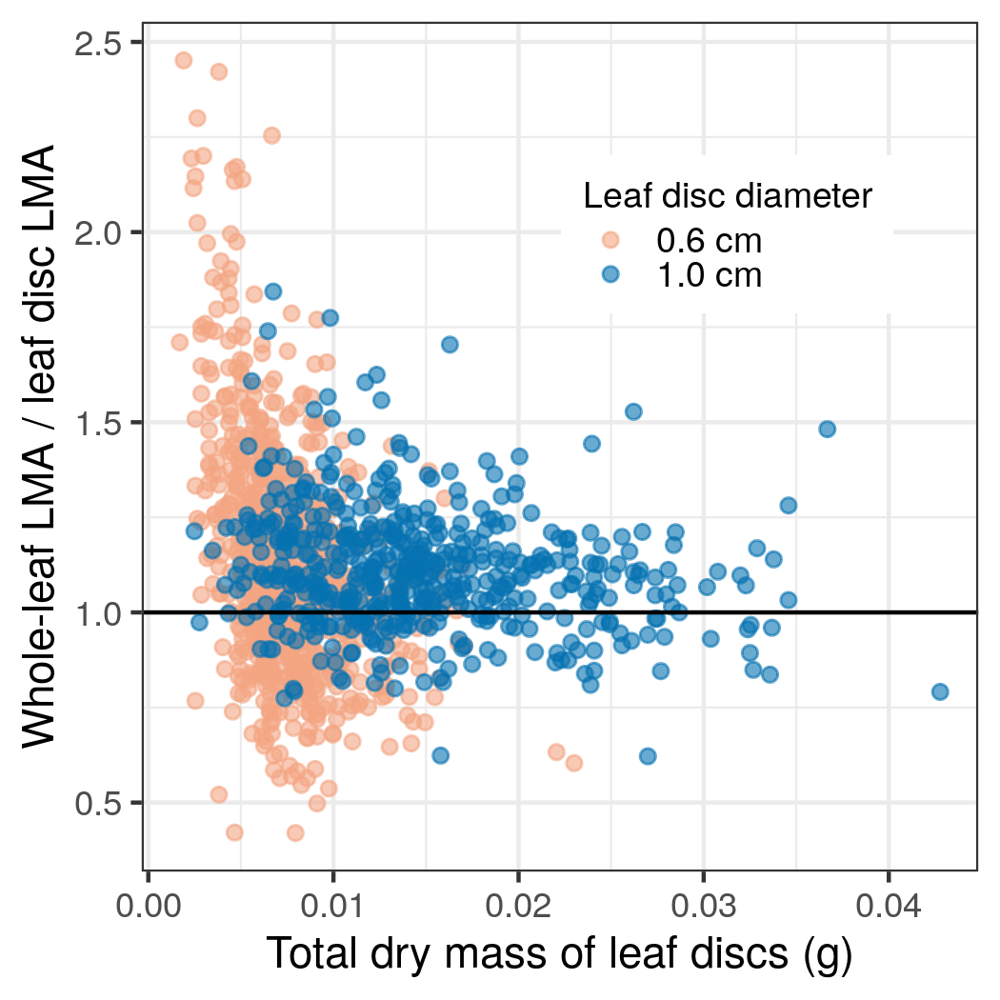

```{r caching, include=FALSE, eval=TRUE}
library(knitr)
library(tidyverse)
library(methods)
library(targets)
basename <- "LMA_method"
opts_chunk$set(fig.path = paste("figs/", sep = ""))
opts_chunk$set(tidy = FALSE,
               warning = FALSE,
               message = FALSE,
               comment = NA,
               verbose = TRUE,
               cache = FALSE,
               echo = FALSE)
# PDF-based figures
opts_chunk$set(dev='pdf')

# https://github.com/haozhu233/kableExtra/issues/47
options(kableExtra.auto_format = FALSE)
library(kableExtra)

# for dependency
targets::tar_load(yml)
#  for non-targets
# val <- yaml::yaml.load_file("../values.yml")
val <- yaml::yaml.load_file("values.yml")
```

# Appendix S1:

Site information.
MAT: mean annual temperature,
MAP: mean annual precipitation,
CV: coefficient variance

```{r, echo=FALSE}
library(jsonlite)
# for dependency
targets::tar_load(site_info)
#site <- fromJSON("../data/site_info.json")
site <- fromJSON("data/site_info.json")
site |>
  kable(format = "html") |>
  kable_styling()
```

The site information and climate data in Yunnan, referred to @Fei2018, and @Song2017.
MAT and MAP at the lower elevation (37 m) on Yakushima were obtained from the Yakushima meteorological stationj.
MAT at the higher elevation (1800 m) on Yakushima was obtained from @Eguchi2006.

\newpage

# Appendix S2:

Detailed sampling protocol for whole-leaf and leaf disc LMA.


\newpage


# Appendix S3:

Generalization for a relationship between ratios of disc-based and whole-leaf estimates of leaf mass per area (LMA), leaf tissue density (LD), and leaf thickness (LT).
For the *i* tree individual or species, the relationship between ratios of disc-based and whole-leaf estimates of LMA, LD, and LT is:

$$
\frac{LDd_i}{LDw_i} = \frac{LMAd_i}{LMAw_i} \frac{LTw_i}{LTd_i}
$$

where *d* indicates disc-based estimates, *w* indicates whole-leaf based estimates.

Because thickness is measured on leaf lamina whether one uses a leaf disc or a whole-leaf, the expected ratio between thickness for a leaf disc and a whole-leaf should be 1.
The above relationship, therefore, can be rewritten using lognormally distributed multiplicative error ($\epsilon_i$) on the arithmetic scale:

$$
\frac{LDd_i}{LDw_i} = \frac{LMAd_i}{LMAw_i} exp(\epsilon_i) \;\;\;\;\epsilon_i \sim N(0, \sigma^2).
$$

LMA requires two times measurements (mass and area) and LD requires three time measurements (mass, area and thickness), and thus variance in the ratio of whole-leaf LD and leaf disc LD should be greater than that of LMA.

As we expected LD, showed the slightly smaller *R^2^* value than LMA (Figure below) in the Yunnan dataset.
We have independent measurement for thickness for leaf discs and whole-leaves in the Yunnan dataset.
If we use the same leaf thickness values for leaf discs and whole-leaves (i.e., LTw~i~/LTd~i~ =1), the scatter plots will be identical for LMA and LD.
Consequently, we do not perform further analyses for LD, because differences between whole-leaf LD and leaf disc LD only depends on the ratio between whole-leaf LMA and leaf disc LMA and measurement errors of leaf thickness.

```{r, include=FALSE}
targets::tar_load(lma_ld_png)
```

{ width="600" style="display: block; margin: 0 auto" }

Figure: Relationships between species mean leaf mass per area (LMA) and leaf tissue density (LD) determined by using whole leaves and leaf discs for the Yunnan dataset that has both leaf thickness for leaf discs and whole leaves.
Dashed lines indicate 1:1 lines.
Blue solid lines indicate standardized major axis regressions.
The 95% confidence intervals are presented as the shaded area.
All the correlations are significant (*P* < 0.001).

\newpage

# Appendix S4:

Standardized regression coefficients modelig the effects of leaf tissue density,
leaf area,
leaf thickness,
punch size, and
their interactios
(a) on the mean estimates of whole-leaf LMA, and
(b) on the estimated variance of whole-leaf LMA.
The leaf disc LMA was used for the baseline mean of the whole-leaf LMA.
Thick and thin lines indicate 90% and 95% credible intervals, respectively.
Circles show posterior means of coefficients.
Circles filled with blue indicate significant effects and white indicate non-significance effects.

```{r, incude=FALSE}
targets::tar_load(coef_sp_punch1_add_plot)
```


\newpage

# Appendix S5:

Relationships between whole-leaf LMA : disc leaf LMA and total dry mass for the leaf disc.
The relationships was heteroscedastic (unequal variance, *p* < 0.001; all the samples were analyzed together).
Samples with small total dry mass tended to show greater variance.

{ width="400" style="display: block; margin: 0 auto" }

\newpage

# Appendix S6:

Summary of a linear mixed model for log-transformed total dry mass of leaf discs for each tree individual.
Species was used as a random intercept.
The leaf punch size is described as an effect of '0.6 cm diameter' compared with '1.0 cm diameter.

```{r, eval=TRUE, echo=FALSE}
tar_load(dm_glmm_tab)
dm_glmm_tab |>
  kable(format = "html") |>
  kable_styling()
```

\newpage

# Appendix S7:

hist


\newpage

# Appendix S7:

Relationships between species mean leaf mass per area (LMA) determined by using whole leaves and leaf discs.
Species groups are divided into four categories on the basis of the medians of the leaf size and leaf thickness across all the species.
Estimates obtained by different leaf punches are plotted separately in different colors.
All the correlations are significant (*P* < 0.001).

{ width="600" style="display: block; margin: 0 auto" }


\newpage
# LITERATURE CITED
