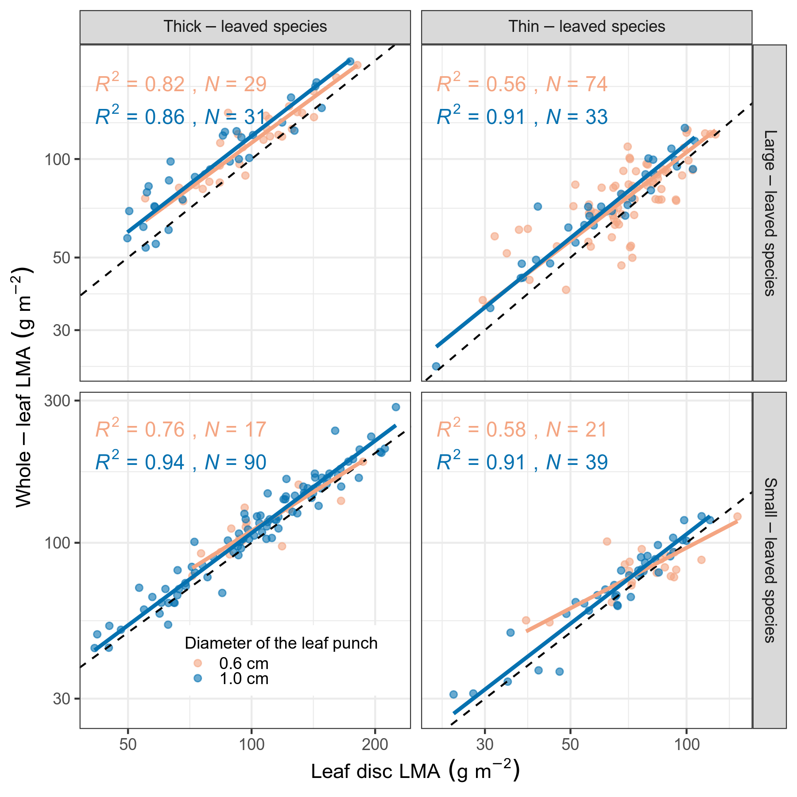

```{r global_options, include=FALSE}
library(knitr)
knitr::opts_chunk$set(
  collapse = TRUE,
  comment = "#>",
  message = FALSE,
  cache = FALSE,
  fig.align = "center",
  fig.show = "hold"
)
```

```{r}
library(tidyverse)
library(targets)
library(kableExtra)
```

# Leaf disc vs whole-leaf LMA (species-level)

## Pooled

<!-- I put tar_load to use {{targets}} -->

```{r, include=FALSE}
tar_load(lalt_pool_grid_png)
```


## Seprated

```{r, include=FALSE}
tar_load(lalt_sep_grid_png)
```




# SMA table

## species

```{r}
tar_load(sma_sp_tab)
sma_sp_tab |>
  kable() |>
  kable_styling()
```


## tree

```{r}
tar_load(sma_tree_tab)
sma_tree_tab |>
  kable() |>
  kable_styling()
```

## tree LD

```{r}
tar_load(sma_tree_ld_tab)
sma_tree_ld_tab |>
  kable() |>
  kable_styling()
```


# Leaf disc vs whole-leaf LMA (individual-level)

```{r, include=FALSE}
tar_load(lalt_tree_grid_png)
```


# Divergence (species-level)

```{r, include=FALSE}
tar_load(ratio_png)
```


# LMA and LD (species-level)

```{r, include=FALSE}
tar_load(lma_ld_png)
```


# CV

```{r, include=FALSE}
tar_load(cv_pool_png)
```


```{r, include=FALSE}
tar_load(cv_sep_png)
```


# Leaf support cost (species-level)

```{r, include=FALSE}
tar_load(petiole_png)
```


# Computing Environment

```{r}
devtools::session_info()
```


```{r}
tar_visnetwork()
```
