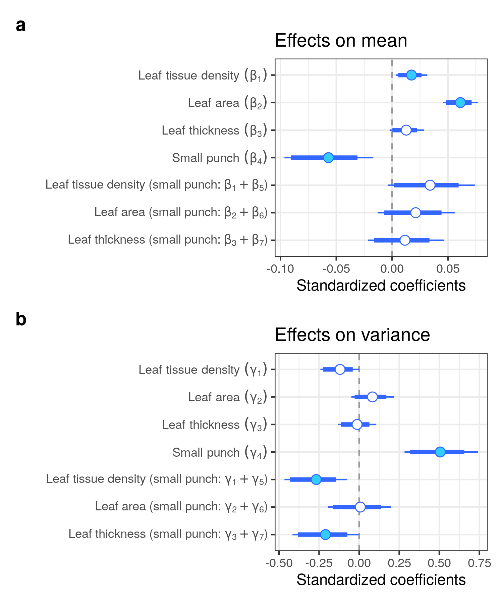
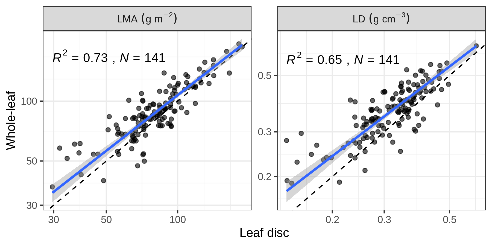
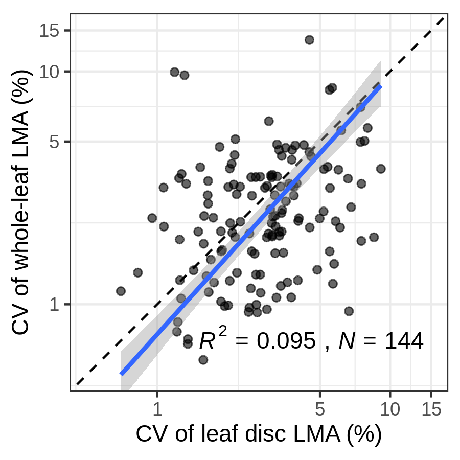
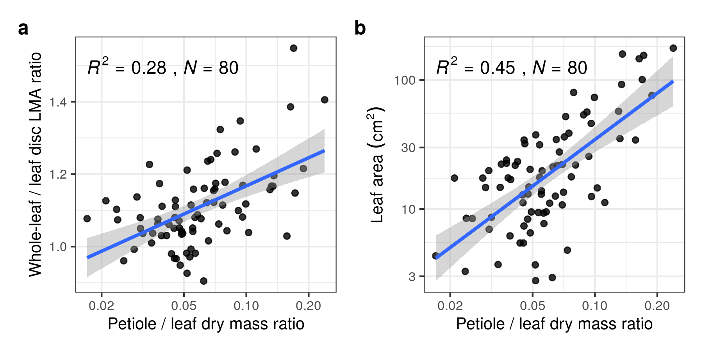

```{r global_options, include=FALSE}
library(knitr)
knitr::opts_chunk$set(
  collapse = TRUE,
  comment = "#>",
  message = FALSE,
  cache = FALSE,
  fig.align = "center",
  fig.show = "hold"
)
```

```{r}
library(tidyverse)
library(targets)
library(kableExtra)
```


# MCMC check

```{r,eval=TRUE}
targets::tar_load(fit_sp_no_lma_summary_model)
targets::tar_load(fit_sp_no_lma_int_summary_model)
targets::tar_load(fit_sp_lma_summary_model)
targets::tar_load(fit_sp_lma2_summary_model2)
targets::tar_load(fit_sp_ld_summary_model)
targets::tar_load(fit_sp_ld3_summary_model)
targets::tar_load(fit_sp_lm_summary_model)
targets::tar_load(fit_sp_lma0_summary_simple)

targets::tar_load(fit_sp_no_lma_diagnostics_model)
targets::tar_load(fit_sp_no_lma_int_diagnostics_model)
targets::tar_load(fit_sp_lma_diagnostics_model)
targets::tar_load(fit_sp_lma2_diagnostics_model2)
targets::tar_load(fit_sp_ld_diagnostics_model)
targets::tar_load(fit_sp_ld3_diagnostics_model)
targets::tar_load(fit_sp_lm_diagnostics_model)
targets::tar_load(fit_sp_lma0_diagnostics_simple)
```


```{r,eval=TRUE}
fit_sp_no_lma_summary_model |> filter(rhat > 1.1)
fit_sp_no_lma_int_summary_model |> filter(rhat > 1.1)
fit_sp_lma_summary_model |> filter(rhat > 1.1)
fit_sp_lma2_summary_model2 |> filter(rhat > 1.1)
fit_sp_ld_summary_model |> filter(rhat > 1.1)
fit_sp_ld3_summary_model |> filter(rhat > 1.1)
fit_sp_lm_summary_model |> filter(rhat > 1.1)
fit_sp_lma0_summary_simple |> filter(rhat > 1.1)
```

It is difficult to model heteroskedasticity and measurement errors at the same time.

```{r,eval=TRUE}
div_check(fit_sp_no_lma_diagnostics_model)
div_check(fit_sp_no_lma_int_diagnostics_model)
div_check(fit_sp_lma_diagnostics_model)
div_check(fit_sp_lma2_diagnostics_model2)
div_check(fit_sp_ld_diagnostics_model)
div_check(fit_sp_ld3_diagnostics_model)
div_check(fit_sp_lm_diagnostics_model)
div_check(fit_sp_lma0_diagnostics_simple)
```

```{r}
targets::tar_load(loo_model)
loo::loo_compare(
  loo_model[[1]], loo_model[[2]], loo_model[[3]],
  loo_model[[4]], loo_model[[5]], loo_model[[6]],
  loo_model[[7]], loo_model[[8]], loo_model[[9]],
  loo_model[[10]], loo_model[[11]])
```

```{r}
tar_read(cv_sp)
```

## coef




``

# Validation

```{r}
tar_load(cv_sp)
cv_sp
```


# LMA and LD (species-level)

```{r, include=FALSE}
tar_load(lma_ld_plot)
```



# CV

```{r, include=FALSE}
tar_load(cv_pool_plot)
```



# Leaf support cost (species-level)

```{r, include=FALSE}
tar_load(petiole_plot)
```



# DM and HDK

```{r}
tar_load(tree)
fit <- lm(log(lma_leaf / lma_disc) ~ log(dry_mass_disc), tree)
lmtest::bptest(fit)
```

# {targets} pipepline

```{r}
targets::tar_visnetwork()
```

# Computing Environment

```{r}
devtools::session_info()
```
