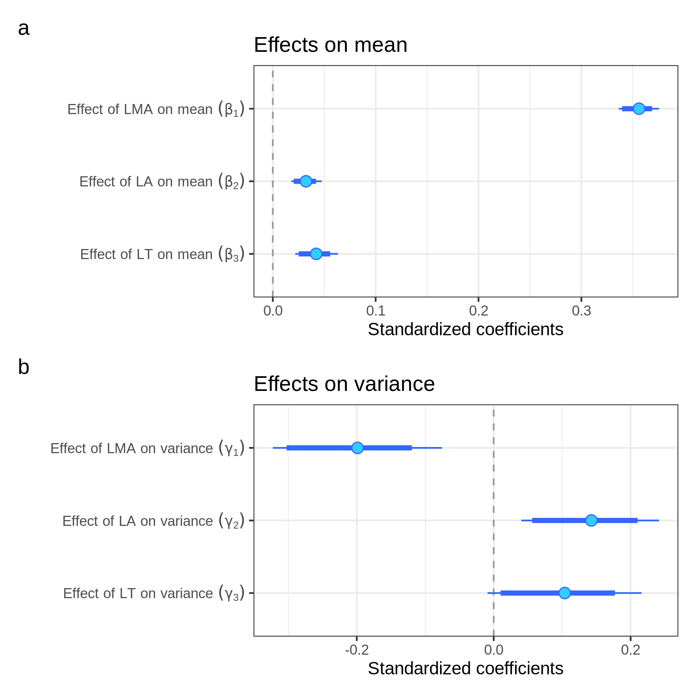
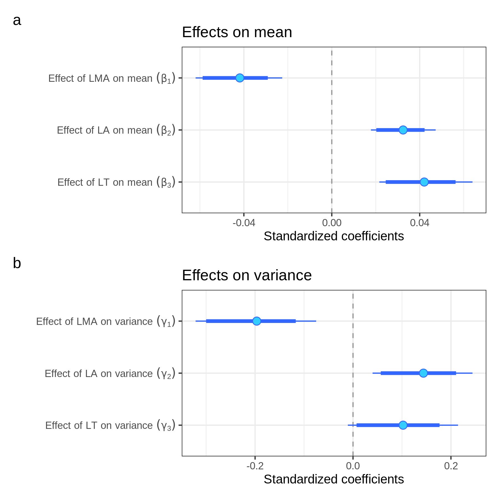
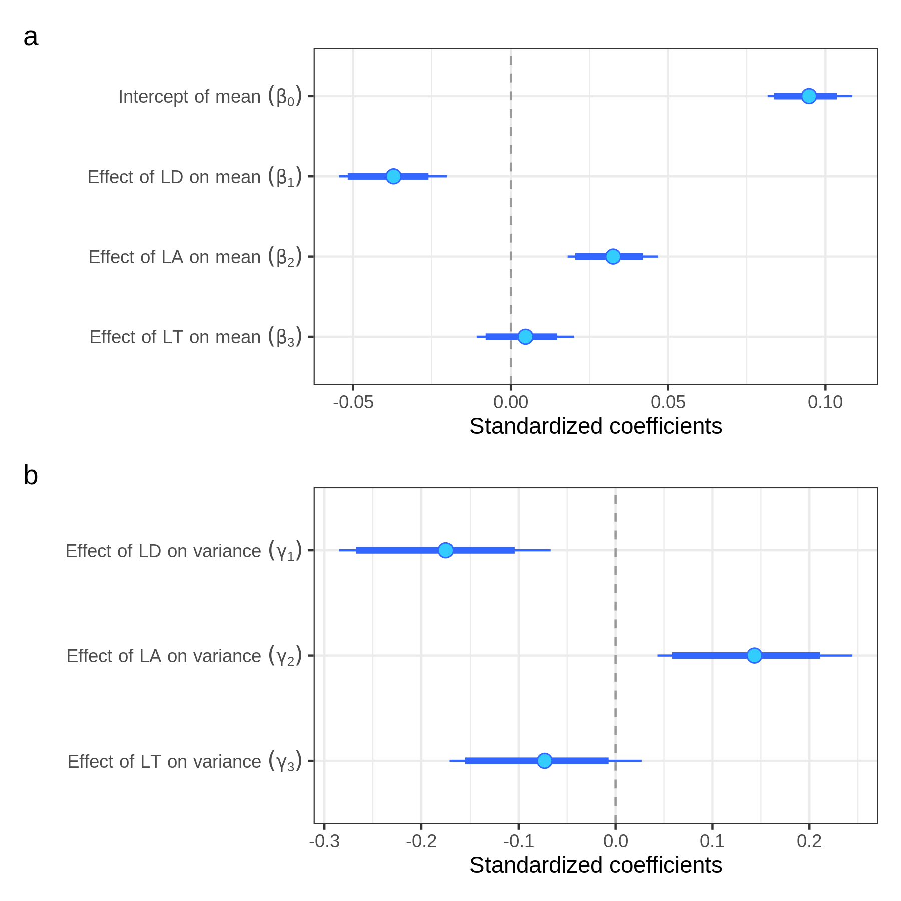

```{r global_options, include=FALSE}
library(knitr)
knitr::opts_chunk$set(
  collapse = TRUE,
  comment = "#>",
  message = FALSE,
  cache = FALSE,
  fig.align = "center",
  fig.show = "hold"
)
```

```{r}
library(tidyverse)
library(targets)
library(kableExtra)
```

# Leaf disc vs whole-leaf LMA (species-level)

## Pooled

<!-- I put tar_load to use {{targets}} -->

```{r, include=FALSE}
tar_load(lalt_pool_grid_png)
```


## Seprated

```{r, include=FALSE}
tar_load(lalt_sep_grid_png)
```

## MCMC check

```{r}
targets::tar_load("fit_sp_0_summary_simple")
targets::tar_load("fit_sp_1_summary_model")
targets::tar_load("fit_sp_11_summary_model")
targets::tar_load("fit_sp_2_summary_model")
targets::tar_load("fit_sp_3_summary_model")
targets::tar_load("fit_sp_33_summary_model")
targets::tar_load("fit_sp_4_summary_sma")
targets::tar_load("fit_sp_5_summary_sma")
targets::tar_load("fit_sp_6_summary_sma_err")

targets::tar_load("fit_sp_0_diagnostics_simple")
targets::tar_load("fit_sp_1_diagnostics_model")
targets::tar_load("fit_sp_11_diagnostics_model")
targets::tar_load("fit_sp_2_diagnostics_model")
targets::tar_load("fit_sp_3_diagnostics_model")
targets::tar_load("fit_sp_33_diagnostics_model")
targets::tar_load("fit_sp_4_diagnostics_sma")
targets::tar_load("fit_sp_5_diagnostics_sma")
targets::tar_load("fit_sp_6_diagnostics_sma_err")
```


```{r}
fit_sp_0_summary_simple |> filter(rhat > 1.1)
fit_sp_1_summary_model |> filter(rhat > 1.1)
fit_sp_11_summary_model |> filter(rhat > 1.1)
fit_sp_2_summary_model |> filter(rhat > 1.1)
fit_sp_3_summary_model |> filter(rhat > 1.1)
fit_sp_33_summary_model |> filter(rhat > 1.1)
fit_sp_4_summary_sma |> filter(rhat > 1.1)
fit_sp_5_summary_sma |> filter(rhat > 1.1)
fit_sp_6_summary_sma_err |> filter(rhat > 1.1)
```

It is difficult to model heteroskedasticity and measurement errors at the same time.

```{r}
div_check(fit_sp_0_diagnostics_simple)
div_check(fit_sp_1_diagnostics_model)
div_check(fit_sp_11_diagnostics_model)
div_check(fit_sp_2_diagnostics_model)
div_check(fit_sp_3_diagnostics_model)
div_check(fit_sp_33_diagnostics_model)
div_check(fit_sp_4_diagnostics_sma)
div_check(fit_sp_5_diagnostics_sma)
div_check(fit_sp_6_diagnostics_sma_err)
```

```{r}
targets::tar_load(loo_model)
loo::loo_compare(loo_model[[1]], loo_model[[2]], loo_model[[3]],
  loo_model[[4]], loo_model[[5]], loo_model[[6]])
```

```{r}
tar_read(cv_sp)
```

## coef

```{r, eval=TRUE}
tar_load(coef_sp_png)
```



```{r, eval=TRUE}
tar_load(coef_sp_png2)
```



```{r, eval=TRUE}
tar_load(coef_sp_png3)
```




# SMA table

## species

```{r, eval=TRUE}
tar_load(sma_sp_tab)
sma_sp_tab |>
  kable() |>
  kable_styling()
```

## species LD

```{r, eval=TRUE}
tar_load(sma_sp_ld_tab)
sma_sp_ld_tab |>
  kable() |>
  kable_styling()
```

## tree

```{r, eval=TRUE}
tar_load(sma_tree_tab)
sma_tree_tab |>
  kable() |>
  kable_styling()
```

## tree LD

```{r, eval=TRUE}
tar_load(sma_tree_ld_tab)
sma_tree_ld_tab |>
  kable() |>
  kable_styling()
```

# Validation

```{r}
tar_load(cv_sp)
cv_sp
```

```{r}
tar_load(cv_tree)
cv_tree
```


# Leaf disc vs whole-leaf LMA (individual-level)

```{r, include=FALSE}
tar_load(lalt_tree_grid_png)
```


# Divergence (species-level)

```{r, include=FALSE}
tar_load(ratio_png)
```


# LMA and LD (species-level)

```{r, include=FALSE}
tar_load(lma_ld_png)
```


# CV

```{r, include=FALSE}
tar_load(cv_pool_png)
```


```{r, include=FALSE}
tar_load(cv_sep_png)
```


# Leaf support cost (species-level)

```{r, include=FALSE}
tar_load(petiole_png)
```


# Computing Environment

```{r}
devtools::session_info()
```


```{r}
tar_visnetwork()
```
