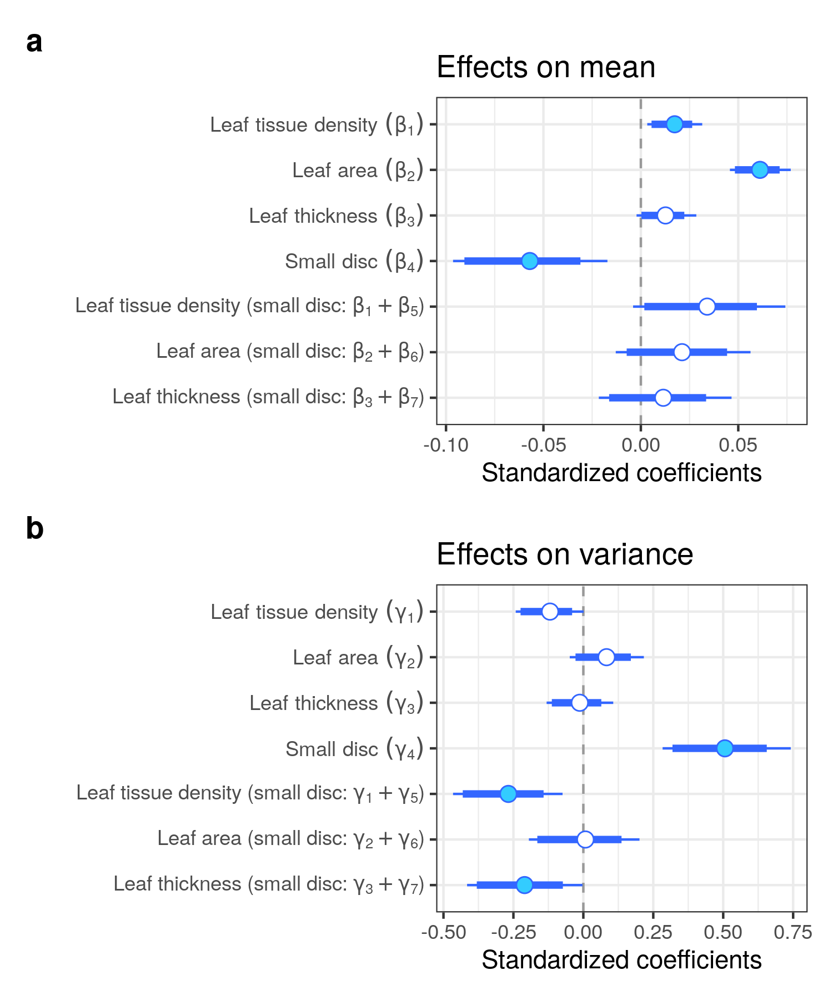

```{r global_options, include=FALSE}
library(knitr)
knitr::opts_chunk$set(
  collapse = TRUE,
  comment = "#>",
  message = FALSE,
  cache = FALSE,
  fig.align = "center",
  fig.show = "hold"
)
```

```{r}
library(tidyverse)
library(targets)
library(kableExtra)
```

```{r}
tar_load(sp_mean)
sp_mean |>
  group_by(ldlalt_gr) |>
  summarise(
    lma_leaf = mean(lma_leaf) |> round(1),
    lma_disc = mean(lma_disc) |> round(1)
  ) |>
  write_csv("data/ldlalt.csv")
```


# Leaf disc vs whole-leaf LMA (species-level)

## Pooled

<!-- I put tar_load to use {{targets}} -->

```{r, include=FALSE}
tar_load(lalt_pool_grid_png)
```


## Seprated

```{r, include=FALSE}
tar_load(lalt_sep_grid_png)
```

## MCMC check

```{r,eval=TRUE}

targets::tar_load(fit_sp_no_lma_summary_model)
targets::tar_load(fit_sp_no_lma_int_summary_model)
targets::tar_load(fit_sp_lma_summary_model)
targets::tar_load(fit_sp_lma2_summary_model2)
targets::tar_load(fit_sp_ld_summary_model)
targets::tar_load(fit_sp_ld2_summary_model2)
targets::tar_load(fit_sp_ld3_summary_model)
targets::tar_load(fit_sp_lm_summary_model)
targets::tar_load(fit_sp_lma0_summary_simple)

targets::tar_load(fit_sp_no_lma_diagnostics_model)
targets::tar_load(fit_sp_no_lma_int_diagnostics_model)
targets::tar_load(fit_sp_lma_diagnostics_model)
targets::tar_load(fit_sp_lma2_diagnostics_model2)
targets::tar_load(fit_sp_ld_diagnostics_model)
targets::tar_load(fit_sp_ld2_diagnostics_model2)
targets::tar_load(fit_sp_ld3_diagnostics_model)
targets::tar_load(fit_sp_lm_diagnostics_model)
targets::tar_load(fit_sp_lma0_diagnostics_simple)
```


```{r,eval=TRUE}
fit_sp_no_lma_summary_model |> filter(rhat > 1.1)
fit_sp_no_lma_int_summary_model |> filter(rhat > 1.1)
fit_sp_lma_summary_model |> filter(rhat > 1.1)
fit_sp_lma2_summary_model2 |> filter(rhat > 1.1)
fit_sp_ld_summary_model |> filter(rhat > 1.1)
fit_sp_ld2_summary_model2 |> filter(rhat > 1.1)
fit_sp_ld3_summary_model |> filter(rhat > 1.1)
fit_sp_lm_summary_model |> filter(rhat > 1.1)
fit_sp_lma0_summary_simple |> filter(rhat > 1.1)
```

It is difficult to model heteroskedasticity and measurement errors at the same time.

```{r,eval=TRUE}
div_check(fit_sp_no_lma_diagnostics_model)
div_check(fit_sp_no_lma_int_diagnostics_model)
div_check(fit_sp_lma_diagnostics_model)
div_check(fit_sp_lma2_diagnostics_model2)
div_check(fit_sp_ld_diagnostics_model)
div_check(fit_sp_ld2_diagnostics_model2)
div_check(fit_sp_ld3_diagnostics_model)
div_check(fit_sp_lm_diagnostics_model)
div_check(fit_sp_lma0_diagnostics_simple)
```

```{r}
targets::tar_load(loo_model)
loo::loo_compare(
  loo_model[[1]], loo_model[[2]], loo_model[[3]],
  loo_model[[4]], loo_model[[5]], loo_model[[6]],
  loo_model[[7]], loo_model[[8]], loo_model[[9]],
  loo_model[[10]], loo_model[[11]],
  loo_model[[12]], loo_model[[13]]
)
```

```{r}
tar_read(cv_sp)
```

## coef




# SMA table

## punch

```{r, eval=TRUE}
tar_load(sma_tab_large)
sma_tab_large |>
  kable() |>
  kable_styling()
```

```{r, eval=TRUE}
tar_load(sma_tab_small)
sma_tab_small |>
  kable() |>
  kable_styling()
```

## species

```{r, eval=TRUE}
tar_load(sma_sp_tab)
sma_sp_tab |>
  kable() |>
  kable_styling()
```


```{r}
sma_sp_tab |>
  write_csv("data/sma_sp_tab.csv")
```


## species LD

```{r, eval=TRUE}
tar_load(sma_sp_ld_tab)
sma_sp_ld_tab |>
  kable() |>
  kable_styling()
```

```{r}
sma_sp_ld_tab |>
  write_csv("data/sma_sp_ld_tab.csv")
```

## species simple

```{r, eval=TRUE}
tar_load(sma_sp_2_tab)
sma_sp_2_tab |>
  kable() |>
  kable_styling()
```

```{r}
sma_sp_2_tab |>
  write_csv("data/sma_sp_2_tab.csv")
```


## tree

```{r, eval=TRUE}
tar_load(sma_tree_tab)
sma_tree_tab |>
  kable() |>
  kable_styling()
```

## tree LD

```{r, eval=TRUE}
tar_load(sma_tree_ld_tab)
sma_tree_ld_tab |>
  kable() |>
  kable_styling()
```

# Validation

```{r}
tar_load(cv_sp)
cv_sp
```

```{r}
tar_load(cv_tree)
cv_tree
```


# Leaf disc vs whole-leaf LMA (individual-level)

```{r, include=FALSE}
tar_load(lalt_tree_grid_png)
```


# Divergence (species-level)

```{r, include=FALSE}
tar_load(ratio_png)
```


# LMA and LD (species-level)

```{r, include=FALSE}
tar_load(lma_ld_png)
```


# CV

```{r, include=FALSE}
tar_load(cv_pool_png)
```


```{r, include=FALSE}
tar_load(cv_sep_png)
```


# Leaf support cost (species-level)

```{r, include=FALSE}
tar_load(petiole_png)
```


# DM and HDK

```{r}
tar_load(tree)
fit <- lm(log(lma_leaf / lma_disc) ~ log(dry_mass_disc), tree)
lmtest::bptest(fit)
```


# Computing Environment

```{r}
devtools::session_info()
```


```{r}
tar_visnetwork()
```
