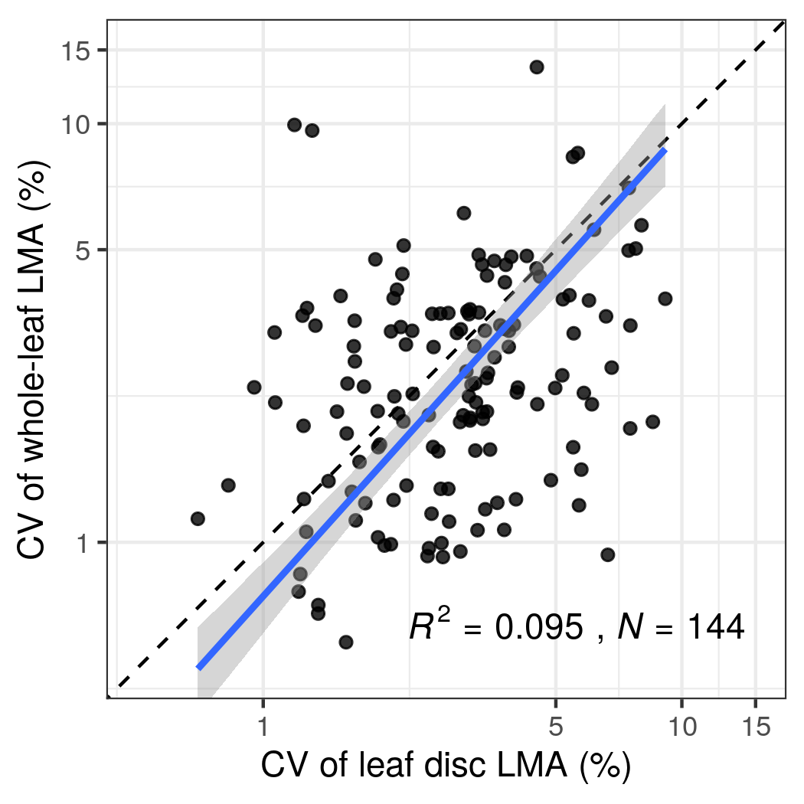

```{r global_options, include=FALSE}
library(knitr)
knitr::opts_chunk$set(
  collapse = TRUE,
  comment = "#>",
  message = FALSE,
  cache = FALSE,
  fig.align = "center",
  fig.show = "hold"
)
```

```{r}
library(tidyverse)
library(targets)
library(kableExtra)
```

# Leaf disc vs whole-leaf LMA (species-level)

## Pooled


## Seprated


# SMA table (species-level)

```{r}
tar_load(sma_tab)
sma_tab |>
  kable() |>
  kable_styling()
```

# Leaf disc vs whole-leaf LMA (individual-level)


# Divergence (species-level)


# LMA and LD (species-level)


# CV





# Leaf support cost (species-level)


# Computing Environment

```{r}
devtools::session_info()
```


```{r}
tar_visnetwork()
```
